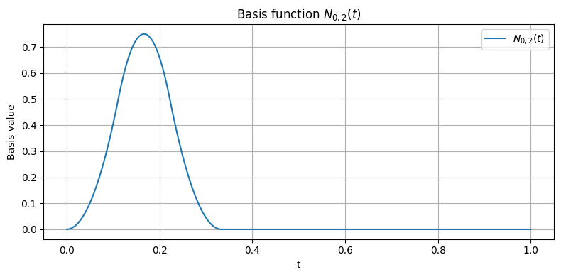
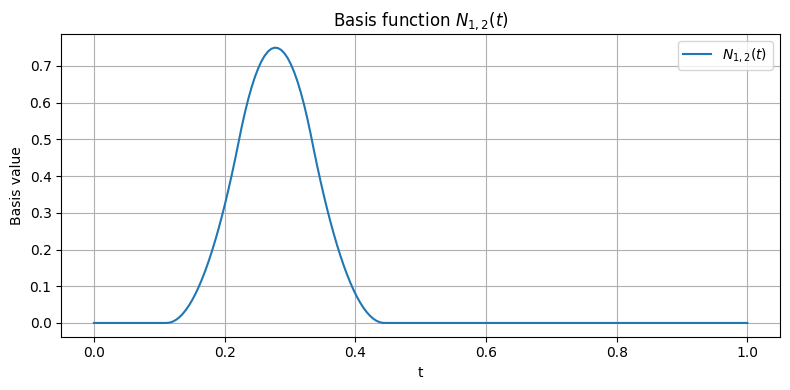
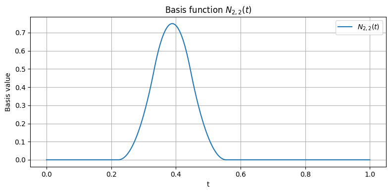
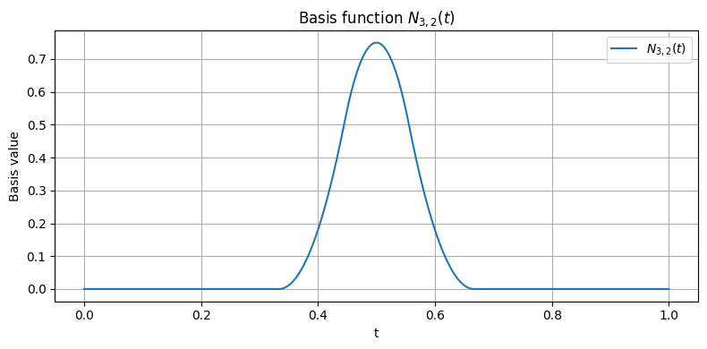
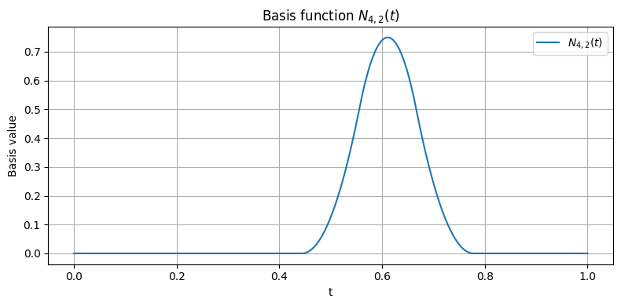
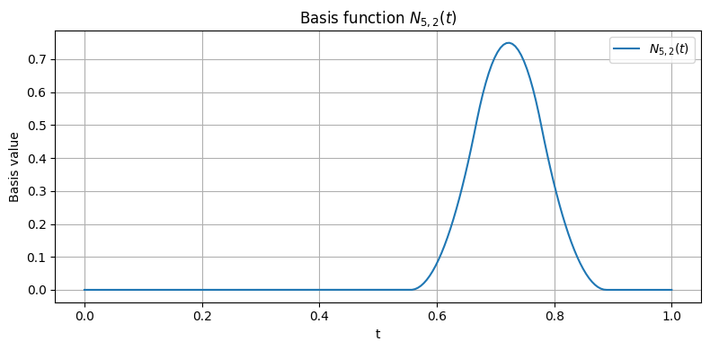
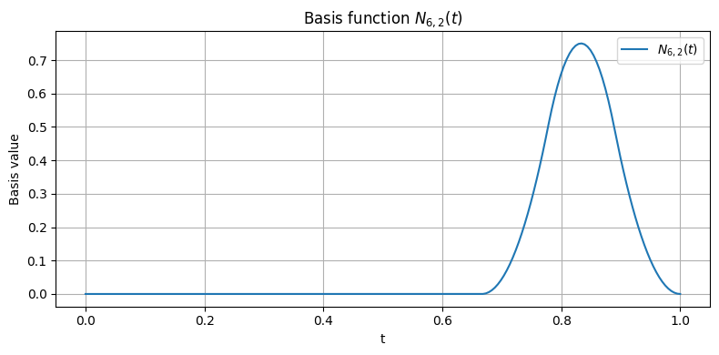

(ch-bsplines-example)=

This example illustrates how B-spline basis functions can be used to approximate a scalar function over a bounded interval. The reference function considered here is the sine function on the domain {math}`[0, 2\pi]`. The example is developed progressively, starting from a piecewise constant approximation and then moving to a B-spline approximation of higher degree.

The objective is not merely computational. Rather, the example is intended to clarify the meaning of the basis functions, the role of the knot vector, and the interpretation of the approximation as a linear combination of basis functions.

## Target Function

Let the target function be

```{math}
f(x) = \sin(x), \qquad x \in [0, 2\pi].
```

This function is smooth and periodic, and therefore provides a convenient benchmark for illustrating both the strengths and the limitations of spline approximations of different degrees.

```{figure} ../imgs/bspline_approximation_spline.png
---
name: fig-bspline-sine-curve
width: 100%
---
Graph of the reference function {math}`y = \sin(x)` over the interval {math}`[0, 2\pi]`. This plot provides the target profile to be approximated in the subsequent constructions.
```

## Piecewise Constant Approximation

As a first step, the domain is subdivided into a finite number of intervals, and the sine function is approximated on each interval by a constant value evaluated at the midpoint. This construction corresponds to a piecewise constant approximation and provides the simplest example of a spline-like representation.

Although such an approximation is crude, it is useful from a pedagogical perspective because it anticipates the construction of degree-zero B-spline basis functions, which are themselves piecewise constant on the knot spans.

```{figure} ../imgs/bspline_approximation_piecewise_approx.png
---
name: fig-bspline-piecewise-constant
width: 100%
---
Comparison between the reference function {math}`y = \sin(x)` and its piecewise constant approximation over a subdivision of the interval. The staircase profile highlights the discontinuous nature of the approximation and motivates the introduction of smoother spline bases.
```

## Approximation by Linear Combination of B-Spline Basis Functions
In this example, the approximation is constructed by means of quadratic B-spline basis functions. Let {math}`p=2` denote the degree and let {math}`n+1` be the number of basis functions. According to the standard definition of a B-spline basis, the knot vector satisfies
```{math}
m = n + p + 1.
```
A uniform knot vector over the interval {math}`[0,2\pi]` can therefore be written as
```{math}
\mathbf{T} = \{ t_0, t_1, \dots, t_m \},
\qquad
t_i = \frac{i}{m}\, 2\pi,
\quad i=0,\dots,m
```
In the present example, the approximation is constructed using {math}`n+1=7` basis functions, hence {math}`n=6`. Therefore,
```{math}
m = n + p + 1 = 6 + 2 + 1 = 9
```
So, in the numerical example, the following knot vector is used:
```{math}
\mathbf{T} = \{0,\; 0.698,\; 1.396,\; 2.094,\; 2.793,\; 3.491,\; 4.189,\; 4.887,\; 5.585,\; 6.283\}.
```

For visualization purposes, it is convenient to introduce the corresponding normalized knot vector over the unit interval {math}`[0,1]`:
```{math}
\widehat{\mathbf{T}} = \{ \hat{t}_0, \hat{t}_1, \dots, \hat{t}_m \},
\qquad
\hat{t}_i = \frac{i}{m},
\quad i=0,\dots,m.
```
Thus, {math}`\mathbf{T}` denotes the knot vector in the original parameter domain, whereas {math}`\widehat{\mathbf{T}}` denotes its normalized counterpart. Both vectors define the same uniform subdivision, expressed on two different intervals.

Once the knot vector has been fixed, the basis functions {math}`N_{i,p}(t)` are evaluated over the parameter domain and assembled into a basis matrix.

```{figure} 

(bspline_approximation_basis_functions)=









Example of a quadratic B-spline basis function {math}`N_{i,2}(t)` plotted over the normalized parameter domain. Each basis function is nonzero only over a limited number of knot spans, illustrating the local support property of the B-spline basis.
```

Each basis function has compact support and contributes only on a limited interval. This local character is one of the main advantages of B-spline representations. When several basis functions are plotted separately, iWhen the basis functions are plotted separately, one observes that they are shifted copies adapted to the knot sequence and that their supports overlap only locally.

In the numerical example, the coefficients are obtained through a least-squares procedure, so that the spline approximation best matches the sampled values of the sine function in the discrete sense. Let {math}`\{x_j\}_{j=1}^{M}` be a set of sampling points in the interval {math}`[0,2\pi]`, and let

```{math}
y_j = f(x_j) = \sin(x_j), \quad j=1,\dots,M
```
be the corresponding function values. Let {math}`N_{i,p}(x)` denote the B-spline basis functions and {math}`w_i` the corresponding coefficients. The spline approximation is defined as a linear combination of B-spline basis functions
```{math}
s(x) = \sum_{i=0}^{n} w_i N_{i,p}(x).
```
In the approximation problem {math}`w_i` are the unknown coefficients (when you draw a B-Spline curve those are the control points).

Evaluating the approximation at the sampling points {math}`x_j` yields:
```{math}
s(x_j) = \sum_{i=0}^{n} w_i N_{i,p}(x_j), \quad j=1,\dots,M.
```
This can be written in matrix form as
```{math}
\mathbf{B}\mathbf{w} \approx \mathbf{y},
```
where {math}`\mathbf{w} = (w_0, w_1, \dots, w_n)^T` is the vector of unknown coefficients, {math}`\mathbf{y} = (y_1, y_2, \dots, y_M)^T` contains the sampled values and {math}`\mathbf{B} \in \mathbb{R}^{M \times (n+1)}` is the basis matrix, defined by
```{math}
B_{j,i} = N_{i,p}(x_j), \quad j=1,\dots,M,\; i=0,\dots,n.
```
Each row of {math}`\mathbf{B}` corresponds to a sampling point, while each column corresponds to a basis function.

Since the number of sampling points {math}`M` is typically larger than the number of basis functions {math}`n+1`, the system is overdetermined. The coefficients are therefore obtained by solving the least-squares problem
```{math}
\min_{\mathbf{w}} \; \|\mathbf{B}\mathbf{w} - \mathbf{y}\|_2^2.
```
This problem seeks the coefficient vector {math}`\mathbf{w}` that minimizes the squared error between the spline approximation and the sampled data. The solution can be computed, for example, via the normal equations
```{math}
\mathbf{B}^T \mathbf{B} \, \mathbf{w} = \mathbf{B}^T \mathbf{y}
```
or by more numerically stable methods such as QR decomposition.

Once the coefficients {math}`w_i` have been determined, the spline approximation is evaluated as
```{math}
s(x) = \sum_{i=0}^{n} w_i N_{i,p}(x).
```
In discrete form, for the sampling points, this corresponds to
```{math}
\mathbf{s} = \mathbf{B}\mathbf{w},
```
where {math}`\mathbf{s}` contains the approximated values of the function.

The following figure shows, visually, the result of this process applied to the example. The figure is particularly useful because it provides a direct geometric interpretation of the spline approximation. It shows how the approximating curve follows the overall behavior of the target function while remaining constrained by the degree of the basis functions and by the distribution of the knots.

```{figure} ../imgs/bspline_approximation_b_spline_approx.png
---
name: fig-bspline-approximation-degree2
width: 100%
---
Approximation of {math}`\sin(x)` by a quadratic B-spline representation. The original function is shown together with the spline approximation, while the vertical dashed lines indicate the knot positions that partition the domain.
```
Moreover, the figure makes clear that the approximation is not obtained by interpolation at every sampled point. Rather, the approximating curve is constructed as a linear combination of B-spline basis functions, each scaled by a corresponding coefficient. These coefficients determine the contribution of each basis function to the final shape of the approximation.

Since each basis function has local support, only a limited number of basis functions are active at any given parameter value. As a consequence, the basis matrix {math}`\mathbf{B}` is sparse, which makes the least-squares computation efficient even for relatively large approximation problems.

The following interactive chart allows the degree and the number of basis functions to be changed and shows the effect of the approximated curve:
```{code-cell} ipython3
:tags: [remove-input]

import numpy as np
import pandas as pd
import altair as alt
from IPython.display import HTML, display

# ------------------------------------------------------------
# Target function
# ------------------------------------------------------------
def f(x):
    return np.sin(x)

# ------------------------------------------------------------
# B-spline basis (Cox-de Boor recursion)
# ------------------------------------------------------------
def bspline_basis(i, p, knots, x):
    x = np.asarray(x, dtype=float)

    if p == 0:
        return np.where(
            ((knots[i] <= x) & (x < knots[i + 1])) |
            ((x == knots[-1]) & (x == knots[i + 1])),
            1.0,
            0.0
        )

    left_denom = knots[i + p] - knots[i]
    right_denom = knots[i + p + 1] - knots[i + 1]

    left_term = np.zeros_like(x, dtype=float)
    right_term = np.zeros_like(x, dtype=float)

    if left_denom != 0:
        left_term = ((x - knots[i]) / left_denom) * bspline_basis(i, p - 1, knots, x)

    if right_denom != 0:
        right_term = ((knots[i + p + 1] - x) / right_denom) * bspline_basis(i + 1, p - 1, knots, x)

    return left_term + right_term

# ------------------------------------------------------------
# Uniform knot vector on [a,b]
# m = n + p + 1, with n+1 = num_basis
# total number of knots = m+1 = num_basis + p + 1
# ------------------------------------------------------------
def make_uniform_knots(a, b, num_basis, degree):
    n = num_basis - 1
    m = n + degree + 1
    return np.linspace(a, b, m + 1)

# ------------------------------------------------------------
# Domain and sampling
# ------------------------------------------------------------
x_min = 0.0
x_max = 2.0 * np.pi
x_vals = np.linspace(x_min, x_max, 400)
y_vals = f(x_vals)

# ------------------------------------------------------------
# Precompute approximations for slider combinations
# ------------------------------------------------------------
degree_values = list(range(0, 6))       # 0,1,2,3,4,5
num_basis_values = list(range(3, 16))   # 3,...,15

rows = []

for degree in degree_values:
    for num_basis in num_basis_values:
        # Need at least degree+1 basis functions for a meaningful basis
        if num_basis < degree + 1:
            continue

        knots = make_uniform_knots(x_min, x_max, num_basis, degree)
        n = num_basis - 1

        B = np.zeros((len(x_vals), num_basis), dtype=float)
        for i in range(num_basis):
            B[:, i] = bspline_basis(i, degree, knots, x_vals)

        weights, _, _, _ = np.linalg.lstsq(B, y_vals, rcond=None)
        y_approx = B @ weights

        for x, y_true, y_fit in zip(x_vals, y_vals, y_approx):
            rows.append({
                "degree": degree,
                "num_basis": num_basis,
                "x": float(x),
                "y_true": float(y_true),
                "y_fit": float(y_fit),
            })

df = pd.DataFrame(rows)
chart_data = alt.Data(values=df.to_dict(orient="records"))

# ------------------------------------------------------------
# Sliders
# ------------------------------------------------------------
degree_slider = alt.binding_range(min=min(degree_values), max=max(degree_values), step=1, name="degree p: ")
basis_slider = alt.binding_range(min=min(num_basis_values), max=max(num_basis_values), step=1, name="number of basis functions: ")

degree_param = alt.param(value=2, bind=degree_slider)
basis_param = alt.param(value=7, bind=basis_slider)

# ------------------------------------------------------------
# Base filter
# ------------------------------------------------------------
base = alt.Chart(chart_data).transform_filter(
    (alt.datum.degree == degree_param) & (alt.datum.num_basis == basis_param)
)

# ------------------------------------------------------------
# Original function in grey
# ------------------------------------------------------------
true_curve = base.mark_line(color="#9ca3af", strokeWidth=3).encode(
    x=alt.X("x:Q", title="x"),
    y=alt.Y("y_true:Q", title="y"),
    tooltip=[
        alt.Tooltip("x:Q", format=".3f"),
        alt.Tooltip("y_true:Q", title="sin(x)", format=".3f"),
    ]
)

# ------------------------------------------------------------
# Approximation in orange
# ------------------------------------------------------------
fit_curve = base.mark_line(color="#f59e0b", strokeWidth=3).encode(
    x="x:Q",
    y="y_fit:Q",
    tooltip=[
        alt.Tooltip("x:Q", format=".3f"),
        alt.Tooltip("y_fit:Q", title="approximation", format=".3f"),
    ]
)

# ------------------------------------------------------------
# Dynamic header
# ------------------------------------------------------------
header = alt.Chart(
    alt.Data(values=[{"dummy": 1}])
).mark_text(
    align="left",
    baseline="middle",
    fontSize=13,
    color="#334155"
).transform_calculate(
    label="'B-spline approximation of sin(x) | degree p = ' + format(" + degree_param.name + ", '.0f') + ' | basis functions = ' + format(" + basis_param.name + ", '.0f')"
).encode(
    text="label:N"
).properties(width=650, height=28)

# ------------------------------------------------------------
# Main chart
# ------------------------------------------------------------
main = (true_curve + fit_curve).properties(
    width=650,
    height=420,
    title="Approximation of sin(x) by B-Spline Basis Functions"
)

chart = alt.vconcat(
    header,
    main,
    spacing=6
).add_params(
    degree_param,
    basis_param
)

display(HTML("""
<style>
.vega-embed:has(.vega-bind-name):has(canvas[aria-label*="Approximation of sin(x) by B-Spline Basis Functions"]),
.vega-embed:has(.vega-bind-name):has(svg[aria-label*="Approximation of sin(x) by B-Spline Basis Functions"]) {
  display: flex;
  flex-direction: column;
  align-items: center;
}

.vega-embed:has(canvas[aria-label*="Approximation of sin(x) by B-Spline Basis Functions"]) .vega-bindings,
.vega-embed:has(svg[aria-label*="Approximation of sin(x) by B-Spline Basis Functions"]) .vega-bindings {
  order: -1;
  display: flex;
  justify-content: center;
  gap: 24px;
  width: 100%;
  margin-bottom: 8px;
}
</style>
"""))

chart
```

As may be observed from the interactive example, increasing the degree and/or the number of basis functions may worsen the approximation when an unclamped uniform knot vector is used together with a least-squares fitting procedure. This behavior is mainly due to the following reasons:

- With an unclamped uniform knot vector, the basis functions do not enforce interpolation or anchoring at the boundaries of the parameter domain. Near the endpoints, fewer basis functions are active, and their influence is not constrained by boundary conditions. As a consequence, the approximation is free to drift near the edges.
- As the degree increases, each basis function has a wider support. This produces a stronger overlap among neighboring basis functions and may introduce near-linear dependencies in the basis matrix. The result is a greater tendency toward oscillations and overshooting, especially close to the boundaries.
- Increasing the number of basis functions may also intensify the overlap structure of the basis and may lead to an ill-conditioned approximation problem, particularly when the knot vector remains unclamped. In this case as well, oscillatory behavior may appear, especially near the endpoints.
- The least-squares procedure minimizes the global approximation error over the sampled data. However, since it does not directly enforce local shape constraints or endpoint conditions, it may produce a curve that fits the data well in an overall sense while exhibiting poor local behavior near the boundaries.

For these reasons, unclamped uniform knot vectors are generally not preferred in geometric modeling. In CAD applications, clamped (open uniform) knot vectors are usually adopted, since they provide a more stable and geometrically intuitive behavior, especially at the endpoints.


The following interactive chart allows the degree and the number of basis functions to be changed and shows the effect of the approximated curve:

```{code-cell} ipython3
:tags: [remove-input]

import numpy as np
import pandas as pd
import altair as alt
from IPython.display import HTML, display

# ------------------------------------------------------------
# Target function
# ------------------------------------------------------------
def f(x):
    return np.sin(x)

# ------------------------------------------------------------
# B-spline basis (Cox-de Boor recursion)
# ------------------------------------------------------------
def bspline_basis(i, p, knots, x):
    x = np.asarray(x, dtype=float)

    if p == 0:
        return np.where(
            ((knots[i] <= x) & (x < knots[i + 1])) |
            ((x == knots[-1]) & (x == knots[i + 1])),
            1.0,
            0.0
        )

    left_denom = knots[i + p] - knots[i]
    right_denom = knots[i + p + 1] - knots[i + 1]

    left_term = np.zeros_like(x, dtype=float)
    right_term = np.zeros_like(x, dtype=float)

    if left_denom != 0:
        left_term = ((x - knots[i]) / left_denom) * bspline_basis(i, p - 1, knots, x)

    if right_denom != 0:
        right_term = ((knots[i + p + 1] - x) / right_denom) * bspline_basis(i + 1, p - 1, knots, x)

    return left_term + right_term

# ------------------------------------------------------------
# Open clamped knot vector on [a,b]
# total number of knots = num_basis + degree + 1
# first and last knots repeated degree+1 times
# ------------------------------------------------------------
def make_clamped_knots(a, b, num_basis, degree):
    num_internal = num_basis - degree - 1

    if num_internal > 0:
        internal = np.linspace(a, b, num_internal + 2)[1:-1]
        knots = np.concatenate((
            np.full(degree + 1, a),
            internal,
            np.full(degree + 1, b)
        ))
    else:
        knots = np.concatenate((
            np.full(degree + 1, a),
            np.full(degree + 1, b)
        ))

    return knots

# ------------------------------------------------------------
# Domain and sampling
# ------------------------------------------------------------
x_min = 0.0
x_max = 2.0 * np.pi
x_vals = np.linspace(x_min, x_max, 400)
y_vals = f(x_vals)

# ------------------------------------------------------------
# Precompute approximations for slider combinations
# ------------------------------------------------------------
degree_values = list(range(0, 6))       # 0,1,2,3,4,5
num_basis_values = list(range(3, 16))   # 3,...,15

rows = []

for degree in degree_values:
    for num_basis in num_basis_values:
        if num_basis < degree + 1:
            continue

        knots = make_clamped_knots(x_min, x_max, num_basis, degree)

        B = np.zeros((len(x_vals), num_basis), dtype=float)
        for i in range(num_basis):
            B[:, i] = bspline_basis(i, degree, knots, x_vals)

        weights, _, _, _ = np.linalg.lstsq(B, y_vals, rcond=None)
        y_approx = B @ weights

        for x, y_true, y_fit in zip(x_vals, y_vals, y_approx):
            rows.append({
                "degree": degree,
                "num_basis": num_basis,
                "x": float(x),
                "y_true": float(y_true),
                "y_fit": float(y_fit),
            })

df = pd.DataFrame(rows)
chart_data = alt.Data(values=df.to_dict(orient="records"))

# ------------------------------------------------------------
# Sliders
# ------------------------------------------------------------
degree_slider = alt.binding_range(
    min=min(degree_values), max=max(degree_values), step=1, name="degree p: "
)
basis_slider = alt.binding_range(
    min=min(num_basis_values), max=max(num_basis_values), step=1,
    name="number of basis functions: "
)

degree_param = alt.param(value=2, bind=degree_slider)
basis_param = alt.param(value=7, bind=basis_slider)

# ------------------------------------------------------------
# Base filter
# ------------------------------------------------------------
base = alt.Chart(chart_data).transform_filter(
    (alt.datum.degree == degree_param) & (alt.datum.num_basis == basis_param)
)

# ------------------------------------------------------------
# Original function in grey
# ------------------------------------------------------------
true_curve = base.mark_line(color="#9ca3af", strokeWidth=3).encode(
    x=alt.X("x:Q", title="x"),
    y=alt.Y("y_true:Q", title="y"),
    tooltip=[
        alt.Tooltip("x:Q", format=".3f"),
        alt.Tooltip("y_true:Q", title="sin(x)", format=".3f"),
    ]
)

# ------------------------------------------------------------
# Approximation in orange
# ------------------------------------------------------------
fit_curve = base.mark_line(color="#f59e0b", strokeWidth=3).encode(
    x="x:Q",
    y="y_fit:Q",
    tooltip=[
        alt.Tooltip("x:Q", format=".3f"),
        alt.Tooltip("y_fit:Q", title="approximation", format=".3f"),
    ]
)

# ------------------------------------------------------------
# Dynamic header
# ------------------------------------------------------------
header = alt.Chart(
    alt.Data(values=[{"dummy": 1}])
).mark_text(
    align="left",
    baseline="middle",
    fontSize=13,
    color="#334155"
).transform_calculate(
    label="'Clamped B-spline approximation of sin(x) | degree p = ' + format(" + degree_param.name + ", '.0f') + ' | basis functions = ' + format(" + basis_param.name + ", '.0f')"
).encode(
    text="label:N"
).properties(width=650, height=28)

# ------------------------------------------------------------
# Main chart
# ------------------------------------------------------------
main = (true_curve + fit_curve).properties(
    width=650,
    height=420,
    title="Approximation of sin(x) by Clamped B-Spline Basis Functions"
)

chart = alt.vconcat(
    header,
    main,
    spacing=6
).add_params(
    degree_param,
    basis_param
)

display(HTML("""
<style>
.vega-embed:has(.vega-bind-name):has(canvas[aria-label*="Approximation of sin(x) by Clamped B-Spline Basis Functions"]),
.vega-embed:has(.vega-bind-name):has(svg[aria-label*="Approximation of sin(x) by Clamped B-Spline Basis Functions"]) {
  display: flex;
  flex-direction: column;
  align-items: center;
}

.vega-embed:has(canvas[aria-label*="Approximation of sin(x) by Clamped B-Spline Basis Functions"]) .vega-bindings,
.vega-embed:has(svg[aria-label*="Approximation of sin(x) by Clamped B-Spline Basis Functions"]) .vega-bindings {
  order: -1;
  display: flex;
  justify-content: center;
  gap: 24px;
  width: 100%;
  margin-bottom: 8px;
}
</style>
"""))

chart
```
The following table summarizes the effects:
```{list-table}
:header-rows: 1

* - Setting
  - Behavior
* - Unclamped uniform
  - Floating curve, unstable at the boundaries
* - Clamped (open uniform)
  - CAD-like behavior, stable
* - High degree + few basis functions
  - Greater tendency to oscillate
* - Low degree + many basis functions
  - More stable, but generally less smooth or less compact
```

## Partition of Unity

A fundamental property of B-spline bases is the partition of unity. More precisely, on the valid parameter interval, the basis functions of degree {math}`p` satisfy
```{math}
\sum_{i=0}^{n} N_{i,p}(x) = 1.
```

This property is of central importance in geometric modeling, since it guarantees affine invariance and contributes to the stability of the spline representation. In the numerical example, it is verified by evaluating all basis functions over the parameter domain and summing them pointwise.

```{figure} ../imgs/bspline_approximation_partition_unity_check.png
---
name: fig-bspline-partition-of-unity
width: 100%
---
Numerical verification of the partition of unity property. The sum of the quadratic B-spline basis functions is plotted together with the reference line {math}`y = 1`. The vertical markers identify the valid interval in which the basis functions form a partition of unity.
```

The figure confirms the theoretical result: on the interval in which the basis is effectively defined, the sum of the basis functions is identically equal to one. Outside this interval, such a property is not generally required, since the supports of the basis functions do not cover the domain in the same way.

## Concluding Remarks

This example provides a concrete interpretation of the main concepts introduced in the theory of B-splines. The piecewise constant approximation clarifies the role of degree-zero basis functions, the recursive construction explains how smoother basis functions are obtained, and the final approximation illustrates the meaning of a spline as a weighted sum of locally supported basis functions.

Moreover, the explicit verification of the partition of unity property emphasizes that B-spline bases are not only convenient computational tools, but also mathematically well-structured objects suitable for geometric modeling and approximation.
