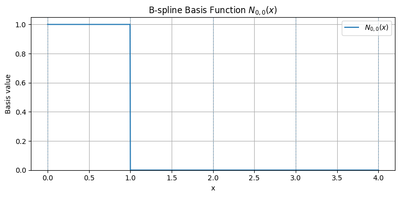
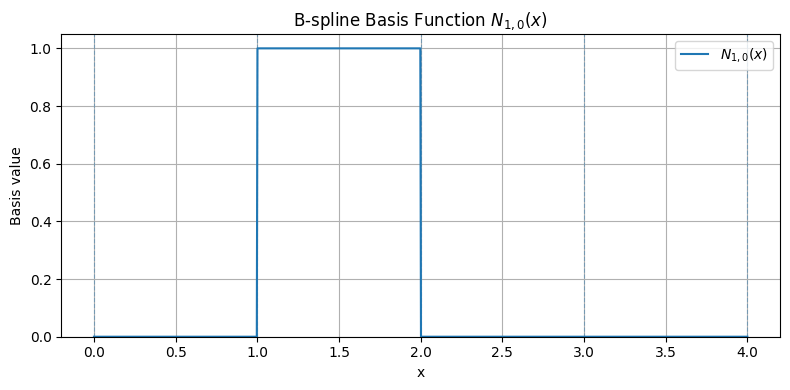
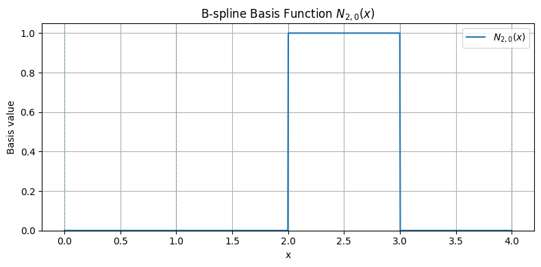
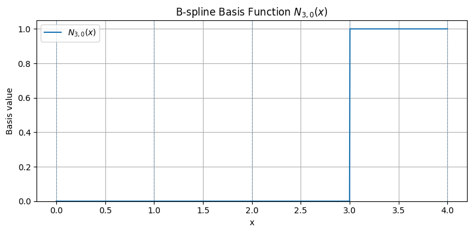
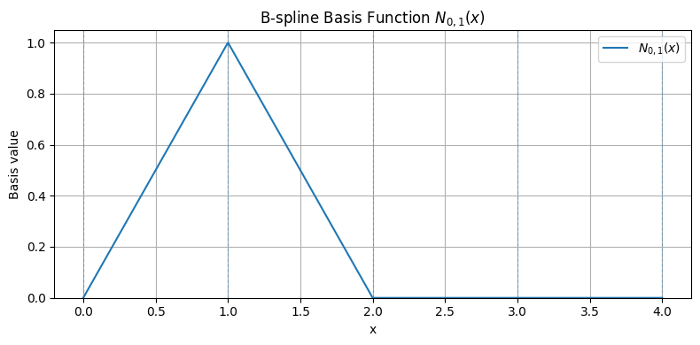
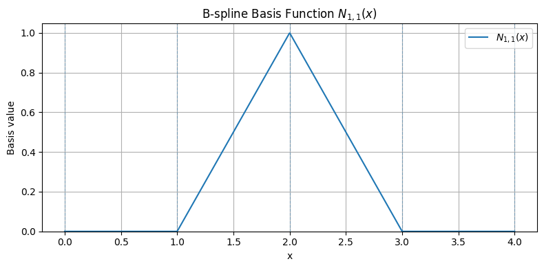
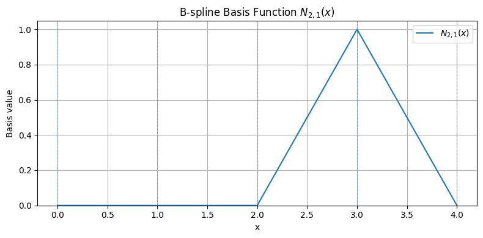
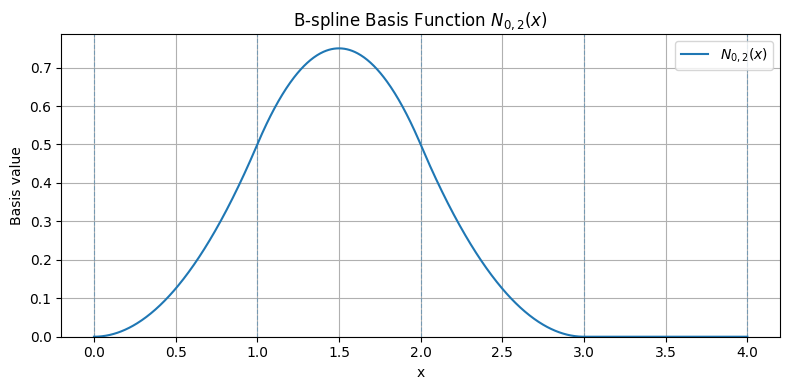
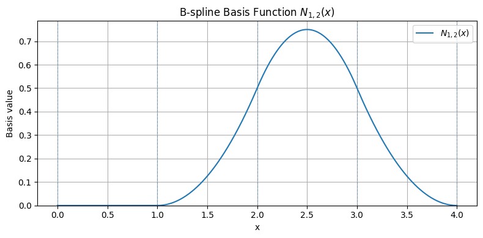
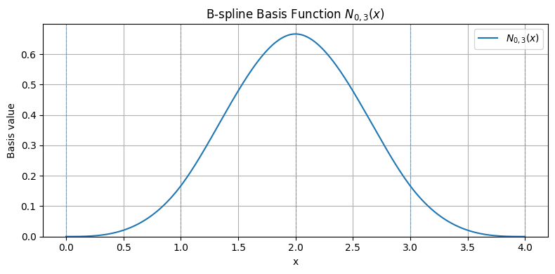

(ch-bsplines-basis)=
A B-spline basis is defined over a knot vector. Let {math}`p` denote the polynomial degree and let {math}`n+1` be the number of basis functions. The knot vector is written as

```{math}
:label: eq_basis
\mathbf{T} = \{ t_0, t_1, \dots, t_m \}, \quad t_i \le t_{i+1}
```

where {math}`m = n + p + 1`. Therefore, the knot vector contains {math}`m+1` knots. Conversely, once the degree {math}`p` and the number of basis functions {math}`n+1` are fixed, the required length of the knot vector is determined uniquely by the Eq. {ref}`eq_basis`. 


By definition, the knot vector is a non-decreasing sequence of real values that partitions the parameter domain. It determines how the basis functions are distributed and how they overlap, and therefore directly controls the support and smoothness of the B-spline basis.


# Recursive Definition of B-Spline Basis Functions

The B-spline basis functions are defined recursively, starting from the zeroth-degree basis functions, which are piecewise constant over the knot spans:

```{math}
N_{i,0}(t) =
\begin{cases}
1 & \text{if } t_i \le t < t_{i+1} \\
0 & \text{otherwise}
\end{cases}
```

These functions constitute the elementary building blocks of the B-spline basis. Each function is nonzero only on a single knot span. The {numref}`bspline_basis_zero_degree` shows an example of B-spline basis functions {math}`N_{i,0}(t)` defined over the knot vector {math}`\mathbf{T} = \{0,1,2,3,4\}`. Each basis function is piecewise constant and equal to one over a single knot span {math}`[t_i, t_{i+1})`, and zero elsewhere. The plots illustrate the local support property, as each basis function is nonzero only on its corresponding interval.

```{figure} 
:label: bspline_basis_zero_degree
(bspline_basis_zero_degree)=





Example of zeroth-degree B-spline basis functions {math}`N_{i,0}(t)` defined over the knot vector {math}`\mathbf{T} = \{0,1,2,3,4\}`. 
```

Higher-degree basis functions are then obtained through the Cox-de Boor recursion formula:

```{math}
N_{i,p}(t) = \frac{t - t_i}{t_{i+p} - t_i} N_{i,p-1}(t)
+ \frac{t_{i+p+1} - t}{t_{i+p+1} - t_{i+1}} N_{i+1,p-1}(t)
```

where each fraction is taken to be zero whenever its denominator vanishes.

This recursive definition constructs basis functions of degree {math}`p` from those of degree {math}`p-1`, ensuring smooth transitions across knot spans.

The {numref}`bspline_basis_one_degree` shows an example of B-spline basis functions {math}`N_{i,1}(t)` defined over the knot vector {math}`\mathbf{T} = \{0,1,2,3,4\}`. Each basis function is piecewise linear, with support over two consecutive knot spans {math}`[t_i, t_{i+2})`. The functions exhibit a triangular shape, reaching their maximum at the central knot and vanishing at the boundaries of their support. 

```{figure} 
:label: bspline_basis_one_degree
(bspline_basis_one_degree)=





Example of first-degree B-spline basis functions {math}`N_{i,1}(t)` defined over the knot vector {math}`\mathbf{T} = \{0,1,2,3,4\}`. 
```
Compared to the zeroth-degree case, the basis functions are no longer piecewise constant but continuous and piecewise linear. This illustrates how the recursive construction increases smoothness: the functions now overlap over adjacent intervals, and the transition between them is continuous, while still preserving the local support property.

By recursion, the B-spline basis functions of degree two {math}`N_{i,2}(t)` and degree three {math}`N_{i,3}(t)` are defined over the same knot vector {math}`\mathbf{T} = \{0,1,2,3,4\}`. {numref}`bspline_basis_two_degree` and {numref}`bspline_basis_three_degree1` illustrate these functions, respectively.

```{figure} 
:label: bspline_basis_two_degree
(bspline_basis_two_degree)=




Example of second-degree B-spline basis functions {math}`N_{i,2}(t)` defined over the knot vector {math}`\mathbf{T} = \{0,1,2,3,4\}`. 
```

```{figure} 
:label: bspline_basis_three_degree1
(bspline_basis_three_degree)=



Example of third-degree B-spline basis functions {math}`N_{i,3}(t)` defined over the knot vector {math}`\mathbf{T} = \{0,1,2,3,4\}`. 
```

Each basis function of degree two is piecewise quadratic and has support over three consecutive knot spans. These functions are continuous and exhibit a smoother profile than the first-degree case. Their increased degree enlarges the support and produces more regular transitions between adjacent basis functions, while preserving the local support property.

Each basis function of degree three is piecewise cubic and has support over four consecutive knot spans. Its shape is smoother and more spread out than in the lower-degree cases. This further illustrates the effect of the recursive construction: as the degree increases, the basis functions become progressively smoother and their support widens, allowing a trade-off between locality and smoothness.

Basis function of degree four (and higher) does not exist for the knot vector defined in this example, simply because there are not enough knots to satisfy the relation {math}`m = n + p + 1`. In the present case, the knot vector {math}`\mathbf{T}=\{0,1,2,3,4\}` contains five knots, hence {math}`m=4`. For degree {math}`p=3`, the relation gives {math}`n = m-p-1 = 4-3-1 = 0`, so only one basis function can be defined. If one attempts to increase the degree to {math}`p=4`, then {math}`n = 4-4-1 = -1`, which is not admissible, since the number of basis functions cannot be negative. Therefore, the chosen knot vector is sufficient to define basis functions only up to degree three. More generally, increasing the degree requires a longer knot vector, since higher-degree B-spline basis functions need a larger number of knots to be properly constructed.

## Knot Vector: Influence, Multiplicity and Continuity

At this point it should be clear that the knot vector plays a fundamental role in determining the behavior of B-spline basis functions. In particular, it directly influences their support and continuity.

### Support

The support of a B-spline basis function {math}`N_{i,p}(t)` is the interval

```{math}
[t_i, t_{i+p+1}).
```
Outside this interval, the basis function is identically zero. Therefore, each basis function is nonzero only over a limited portion of the parameter domain. This property is known as local support and implies that any modification to a coefficient (or control point) affects the curve only within the corresponding interval. As a consequence, B-spline representations allow for localized control of the shape.

This has a subtle consequence. The functions always do sum to 1, but only on the valid parameter interval, not necessarily on the entire domain covered by the knots. In other words, the partition of unity property holds only on the valid parameter interval {math}`[t_p,\, t_{n+1}]`. In the example, given the knot vector  {math}`\mathbf{T} = \{0,1,2,3,4\}`, this interval does not include the first knot span {math}`[t_0,\, t_1)`. As a consequence, the basis functions do not form a complete partition in this region, and their sum is not equal to one. For instance, consider the basis functions of degree {math}`p=1`. Since the knot vector contains five knots, one has {math}`m=4`, and therefore {math}`n = m - p - 1 = 4 - 1 - 1 = 2`. Hence, the valid parameter interval is {math}`[t_p,\, t_{n+1}] = [t_1,\, t_3] = [1,3]`. It follows that the partition of unity property holds only for {math}`t \in [1,3]`. In particular, on the first knot span {math}`[0,1)`, the basis functions do not sum to one, because the basis is not complete in that portion of the domain. 

This can be solved by playing with the multiplicity of the knot.

### Multiplicity and Continuity
The multiplicity of a knot is the number of times that a given knot value is repeated in the knot vector. The continuity of B-spline basis functions depends on the multiplicity of the knots. If a knot {math}`t_k` has multiplicity {math}`r`, then the continuity of the basis functions at that knot is
```{math}
C^{p-r}.
```
In particular, if a knot appears only once ({math}`r=1`), the basis functions are {math}`C^{p-1}` continuous at that location; increasing the multiplicity reduces the continuity and if the multiplicity is equal to {math}`p+1`, the basis functions are discontinuous at that knot.
Thus, by adjusting the multiplicity of the knots, it is possible to control the smoothness of the B-spline basis and, consequently, of the resulting curve.

The following interactive chart is intended to illustrate the partition of unity property of B-spline basis functions in an interactive way. Given a knot vector and a degree, the basis functions are evaluated recursively by means of the Cox-de Boor formula and then added pointwise over the parameter domain. The resulting plot compares their sum with the constant value {math}`1`, making it possible to observe whether the partition of unity property is satisfied. The valid interval {math}`[t_p,\, t_{n+1}]` is also indicated, so that the influence of the knot vector and of the degree on the definition domain of the basis can be understood. 


```{code-cell} ipython3
:tags: [remove-input]

import numpy as np
import pandas as pd
import altair as alt
from IPython.display import HTML, display

# ------------------------------------------------------------
# B-spline basis (Cox-de Boor recursion)
# ------------------------------------------------------------
def bspline_basis(i, p, knots, x):
    x = np.asarray(x, dtype=float)
    knots = np.asarray(knots, dtype=float)

    if p == 0:
        return np.where(
            ((knots[i] <= x) & (x < knots[i + 1])) |
            ((x == knots[-1]) & (x == knots[i + 1])),
            1.0,
            0.0
        )

    left_denom = knots[i + p] - knots[i]
    right_denom = knots[i + p + 1] - knots[i + 1]

    left_term = np.zeros_like(x, dtype=float)
    right_term = np.zeros_like(x, dtype=float)

    if left_denom != 0:
        left_term = ((x - knots[i]) / left_denom) * bspline_basis(i, p - 1, knots, x)

    if right_denom != 0:
        right_term = ((knots[i + p + 1] - x) / right_denom) * bspline_basis(i + 1, p - 1, knots, x)

    return left_term + right_term


# ------------------------------------------------------------
# Preset knot vectors
# ------------------------------------------------------------
knot_presets = {
    "0, 1, 2, 3, 4": [0, 1, 2, 3, 4],
    "0, 0, 1, 2, 3, 4, 4": [0, 0, 1, 2, 3, 4, 4],
    "0, 0, 0, 0, 1, 2, 3, 4, 4, 4, 4": [0, 0, 0, 0, 1, 2, 3, 4, 4, 4, 4],
    "0, 0, 0, 1, 2, 3, 4, 4, 4": [0, 0, 0, 1, 2, 3, 4, 4, 4],
    "0, 0, 0, 0, 4, 4, 4, 4": [0, 0, 0, 0, 4, 4, 4, 4],
    "0,0,0,0, 1,2,2,3, 4,4,4,4": [0,0,0,0, 1,2,2,3, 4,4,4,4],
    "0,0,0,0, 1,2,2,2,3, 4,4,4,4":[0,0,0,0, 1,2,2,2,3, 4,4,4,4],
    "0,0,0,0, 1,2,2,2,2,3, 4,4,4,4":[0,0,0,0, 1,2,2,2,2,3, 4,4,4,4]
}

degree_values = list(range(0, 6))
num_points = 600

# ------------------------------------------------------------
# Precompute data
# ------------------------------------------------------------
rows = []
meta_rows = []

for knot_label, knots in knot_presets.items():
    knots = np.asarray(knots, dtype=float)
    x = np.linspace(knots[0], knots[-1], num_points)

    for degree in degree_values:
        n_basis = len(knots) - degree - 1

        if n_basis <= 0:
            continue

        sum_basis = np.zeros_like(x)
        for i in range(n_basis):
            sum_basis += bspline_basis(i, degree, knots, x)

        left = knots[degree]
        right = knots[n_basis]

        for xv, yv in zip(x, sum_basis):
            rows.append({
                "knot_label": knot_label,
                "degree": degree,
                "x": float(xv),
                "sum_basis": float(yv),
                "left": float(left),
                "right": float(right),
            })

        meta_rows.append({
            "knot_label": knot_label,
            "degree": degree,
            "left": float(left),
            "right": float(right),
            "n_basis": int(n_basis),
        })

df = pd.DataFrame(rows)
df_meta = pd.DataFrame(meta_rows)

chart_data = alt.Data(values=df.to_dict(orient="records"))
meta_data = alt.Data(values=df_meta.to_dict(orient="records"))

# ------------------------------------------------------------
# Controls
# ------------------------------------------------------------
degree_slider = alt.binding_range(
    min=min(degree_values),
    max=max(degree_values),
    step=1,
    name="degree p: "
)

knot_dropdown = alt.binding_select(
    options=list(knot_presets.keys()),
    name="knot vector: "
)

degree_param = alt.param(value=1, bind=degree_slider)
knot_param = alt.param(value="0, 1, 2, 3, 4", bind=knot_dropdown)

# ------------------------------------------------------------
# Base filtered chart
# ------------------------------------------------------------
base = alt.Chart(chart_data).transform_filter(
    (alt.datum.degree == degree_param) & (alt.datum.knot_label == knot_param)
)

meta = alt.Chart(meta_data).transform_filter(
    (alt.datum.degree == degree_param) & (alt.datum.knot_label == knot_param)
)

# ------------------------------------------------------------
# Sum of basis functions
# ------------------------------------------------------------
sum_curve = base.mark_line(strokeWidth=3).encode(
    x=alt.X("x:Q", title="x"),
    y=alt.Y("sum_basis:Q", title="sum of basis functions"),
    tooltip=[
        alt.Tooltip("x:Q", format=".3f"),
        alt.Tooltip("sum_basis:Q", title="sum", format=".6f"),
    ]
)

# ------------------------------------------------------------
# Reference line y = 1
# ------------------------------------------------------------
ref_df = pd.DataFrame({"y": [1.0]})
ref_data = alt.Data(values=ref_df.to_dict(orient="records"))

ref_line = alt.Chart(ref_data).mark_rule(
    strokeDash=[6, 4],
    color="black"
).encode(
    y="y:Q"
)

# ------------------------------------------------------------
# Valid interval markers
# ------------------------------------------------------------
left_rule = meta.mark_rule(color="red", strokeDash=[2, 2]).encode(
    x="left:Q"
)

right_rule = meta.mark_rule(color="green", strokeDash=[2, 2]).encode(
    x="right:Q"
)

# ------------------------------------------------------------
# Dynamic header
# ------------------------------------------------------------
header = alt.Chart(
    alt.Data(values=[{"dummy": 1}])
).mark_text(
    align="left",
    baseline="middle",
    fontSize=13,
    color="#334155"
).transform_calculate(
    label="'Partition of unity | degree p = ' + format(" + degree_param.name + ", '.0f') + ' | knots = ' + " + knot_param.name
).encode(
    text="label:N"
).properties(width=700, height=28)

# ------------------------------------------------------------
# Metadata text
# ------------------------------------------------------------
meta_text = meta.mark_text(
    align="left",
    baseline="top",
    fontSize=12,
    color="#334155",
    dx=8,
    dy=8
).encode(
    x=alt.value(10),
    y=alt.value(10),
    text=alt.value("")
).transform_calculate(
    label="'n_basis = ' + datum.n_basis + ' | valid interval = [' + format(datum.left, '.3f') + ', ' + format(datum.right, '.3f') + ']'"
).encode(
    text="label:N"
)

# ------------------------------------------------------------
# Main chart
# ------------------------------------------------------------
main = (ref_line + sum_curve + left_rule + right_rule + meta_text).properties(
    width=700,
    height=420,
    title="Partition of Unity Check for B-Spline Basis Functions"
)

chart = alt.vconcat(
    header,
    main,
    spacing=6
).add_params(
    degree_param,
    knot_param
)

display(HTML("""
<style>
.vega-embed:has(.vega-bind-name):has(canvas[aria-label*="Partition of Unity Check for B-Spline Basis Functions"]),
.vega-embed:has(.vega-bind-name):has(svg[aria-label*="Partition of Unity Check for B-Spline Basis Functions"]) {
  display: flex;
  flex-direction: column;
  align-items: center;
}

.vega-embed:has(canvas[aria-label*="Partition of Unity Check for B-Spline Basis Functions"]) .vega-bindings,
.vega-embed:has(svg[aria-label*="Partition of Unity Check for B-Spline Basis Functions"]) .vega-bindings {
  order: -1;
  display: flex;
  flex-wrap: wrap;
  justify-content: center;
  gap: 24px;
  width: 100%;
  margin-bottom: 8px;
}
</style>
"""))

chart
```

The effect of knot multiplicity on continuity leads naturally to the definition of an open (clamped) knot vector, namely a knot vector in which the first and last knots have multiplicity {math}`p+1`. In this case, the corresponding B-spline curve interpolates its first and last control points. The internal knots may have lower multiplicity, thus allowing local control of continuity within the curve while preserving endpoint interpolation. An important consequence is that, for an open knot vector, the partition of unity property holds over the entire parameter domain of the curve, so the spline remains properly anchored at its endpoints. By contrast, if the knot vector is not clamped, this property generally holds only on the interior valid interval, and the curve does not necessarily interpolate the endpoints.

What happens, instead, if we change the multiplicity of an internal knot? To illustrate the effect of internal knot multiplicity, it is useful to consider a knot vector in which a single internal knot is repeated with increasing multiplicity. As the multiplicity increases, the continuity at that knot decreases from {math}`C^{p-1}` to {math}`C^{0}`, and when the multiplicity reaches {math}`p+1`, continuity is completely lost and the curve splits into separate pieces at that parameter value. This provides a direct and effective mechanism for locally controlling the smoothness of the curve.

```{code-cell} ipython3
:tags: [remove-input]

import numpy as np
import pandas as pd
import altair as alt
from IPython.display import HTML, display

degree = 3
max_panels = 4

def bspline_basis(i, p, knots, x):
    x = np.asarray(x, dtype=float)
    knots = np.asarray(knots, dtype=float)

    if p == 0:
        return np.where(
            ((knots[i] <= x) & (x < knots[i + 1])) |
            ((x == knots[-1]) & (x == knots[i + 1])),
            1.0,
            0.0
        )

    left_denom = knots[i + p] - knots[i]
    right_denom = knots[i + p + 1] - knots[i + 1]

    left_term = np.zeros_like(x, dtype=float)
    right_term = np.zeros_like(x, dtype=float)

    if left_denom != 0:
        left_term = ((x - knots[i]) / left_denom) * bspline_basis(i, p - 1, knots, x)

    if right_denom != 0:
        right_term = ((knots[i + p + 1] - x) / right_denom) * bspline_basis(i + 1, p - 1, knots, x)

    return left_term + right_term


knot_presets = {
    "[0, 1, 2, 3, 4]": [0, 1, 2, 3, 4],
    "[0, 1, 2, 2, 3, 4]": [0, 1, 2, 2, 3, 4],
    "[0, 1, 2, 2, 2, 3, 4]": [0, 1, 2, 2, 2, 3, 4],
    "[0, 1, 2, 2, 2, 2, 3, 4]": [0, 1, 2, 2, 2, 2, 3, 4],
}

rows = []
meta_rows = []

for knot_label, knots in knot_presets.items():
    knots = np.asarray(knots, dtype=float)
    n_basis = len(knots) - degree - 1

    if n_basis <= 0:
        continue

    x = np.linspace(knots[0], knots[-1], 500)

    for panel_index in range(max_panels):
        basis_name = f"N_{{{panel_index},{degree}}}(t)"

        if panel_index < n_basis:
            y = bspline_basis(panel_index, degree, knots, x)
            is_empty = False
        else:
            y = np.full_like(x, np.nan, dtype=float)
            is_empty = True

        for xv, yv in zip(x, y):
            rows.append({
                "knot_label": knot_label,
                "panel_index": panel_index,
                "panel_name": basis_name,
                "x": float(xv),
                "y": None if np.isnan(yv) else float(yv),
                "is_empty": is_empty,
            })

    meta_rows.append({
        "knot_label": knot_label,
        "n_basis": int(n_basis),
    })


df = pd.DataFrame(rows)
df_meta = pd.DataFrame(meta_rows)

chart_data = alt.Data(values=df.to_dict(orient="records"))
meta_data = alt.Data(values=df_meta.to_dict(orient="records"))

knot_dropdown = alt.binding_select(
    options=list(knot_presets.keys()),
    name="knot vector: "
)

knot_param = alt.param(
    name="selected_knot",
    value="[0, 1, 2, 3, 4]",
    bind=knot_dropdown
)

base = alt.Chart(chart_data).transform_filter(
    alt.datum.knot_label == knot_param
)

meta = alt.Chart(meta_data).transform_filter(
    alt.datum.knot_label == knot_param
)

panel_bg = base.mark_rect(
    fill="white",
    stroke="#d1d5db"
).encode(
    x=alt.value(0),
    x2=alt.value(260),
    y=alt.value(0),
    y2=alt.value(180)
).properties(
    width=260,
    height=180,
    name="panel_bg"
)

basis_plot = base.transform_filter(
    alt.datum.is_empty == False
).mark_line(
    strokeWidth=3
).encode(
    x=alt.X("x:Q", title="t"),
    y=alt.Y("y:Q", title="Basis value", scale=alt.Scale(domain=[0, 1.05])),
    tooltip=[
        alt.Tooltip("panel_name:N", title="Basis"),
        alt.Tooltip("x:Q", format=".3f"),
        alt.Tooltip("y:Q", format=".6f"),
    ]
).properties(
    width=260,
    height=180,
    name="basis_plot"
)

empty_text = base.transform_filter(
    alt.datum.is_empty == True
).mark_text(
    color="#9ca3af",
    fontSize=14,
    align="center",
    baseline="middle"
).encode(
    x=alt.value(130),
    y=alt.value(90),
    text=alt.value("empty")
).properties(
    width=260,
    height=180,
    name="empty_text"
)

grid = alt.layer(
    panel_bg,
    basis_plot,
    empty_text
).facet(
    facet=alt.Facet(
        "panel_name:N",
        sort=[f"N_{{{i},{degree}}}(t)" for i in range(max_panels)],
        title=None
    ),
    columns=2
).properties(
    name="basis_grid"
)

header = alt.Chart(
    alt.Data(values=[{"dummy": 1}])
).mark_text(
    align="left",
    baseline="middle",
    fontSize=13,
    color="#334155"
).transform_calculate(
    label="'B-spline basis functions | degree p = 3 | knots = ' + selected_knot"
).encode(
    text="label:N"
).properties(
    width=560,
    height=28,
    name="header"
)

meta_text = meta.mark_text(
    align="left",
    baseline="middle",
    fontSize=12,
    color="#334155"
).transform_calculate(
    label="'number of basis functions = ' + datum.n_basis"
).encode(
    text="label:N"
).properties(
    width=560,
    height=20,
    name="meta_text"
)

chart = alt.vconcat(
    header,
    meta_text,
    grid,
    spacing=8
).add_params(
    knot_param
)

display(HTML("""
<style>
.vega-embed:has(.vega-bind-name) {
  display: flex;
  flex-direction: column;
  align-items: center;
}

.vega-embed .vega-bindings {
  order: -1;
  display: flex;
  justify-content: center;
  width: 100%;
  margin-bottom: 10px;
}
</style>
"""))

chart
```

### Spacing

The spacing of the knots in the knot vector has a direct influence on the shape and behavior of the B-spline basis functions. In particular, it determines how the basis functions are distributed over the parameter domain and how they interact with each other.

Two main cases are of interest. A knot vector is said to be **uniform** if consecutive knots are equally spaced, that is
```{math}
t_{i+1} - t_i = \text{constant}
```
In this case, the corresponding B-spline basis functions are essentially translated copies of one another.
This leads to a regular and predictable structure: each basis function has the same shape and differs only by a shift along the parameter domain. Uniform spacing is sometimes preferred in practice because it provides a simple and stable behavior of the basis and simplifies both analysis and computation.

A knot vector is said to be **non-uniform** if the spacing between consecutive knots is not constant. In this case, the shape and distribution of the basis functions are no longer identical. Changing the spacing between knots affects how strongly the curve is influenced in different regions of the domain. In particular: when knots are closer together, the curve is pulled closer to the associated control points; when knots are further apart, the influence of the corresponding control points is more spread out. Non-uniform spacing therefore provides additional flexibility, allowing local refinement of the curve and more precise control of its shape. 

Any B-spline whose knot vector is neither uniform nor open uniform is non-uniform. Non-uniform knot vectors allow any spacing of the knots, including multiple knots (adjacent knots with the same value). Standard procedure is to use uniform or open-uniform B-splines unless there is a very good reason not to do so (and CAD hold a very good one!). Moving two knots closer together tends to move the curve only slightly and so there is usually little point in doing it. This leads to the conclusion that the main use of non-uniform B-splines is to allow for multiple knots, which adjust the continuity of the curve at the knot values. However, non-uniform B-splines are the general form of the B-spline because they incorporate open uniform and uniform B-splines as special cases. Thus we will talk about non-uniform B-splines when we mean the general case, incorporating both uniform and open uniform.


## Properties of B-Spline Basis Functions

Given the discussion above, B-spline basis functions satisfy several fundamental properties that make them particularly suitable for geometric modeling and curve design.

- Local Support. Each basis function {math}`N_{i,p}(t)` is nonzero only on the interval {math}`[t_i, t_{i+p+1})`. Outside this interval, it vanishes identically. As a consequence, each basis function affects the curve only over a limited portion of the parameter domain. This property is known as local support and is one of the main reasons why B-splines provide effective local shape control. This property ensures that changes to a control point affect the curve only locally.
- Non-Negativity. {math}`N_{i,p}(t) \ge 0` for all {math}`t`. Thus, B-spline basis functions are always non-negative. This property contributes to the numerical stability of the representation and plays an important role in the geometric behavior of the resulting curve.
- On the valid parameter interval, the basis functions form a partition of unity, namely  {math}`\sum_i N_{i,p}(t) = 1` for all {math}`t` in the valid parameter domain. This means that, at each parameter value in the valid domain, the basis functions define a convex combination of the associated control points. As a result, the curve inherits important geometric properties such as affine invariance and predictable shape behavior.
- The continuity of the basis functions depends on the multiplicity of knots. If a knot has multiplicity {math}`k`, then the continuity at that knot is {math}`C^{p-k}`. Therefore, increasing the multiplicity of a knot reduces the continuity at that location. In this way, the knot vector provides direct control over the smoothness of the basis functions and, consequently, of the resulting B-spline curve.

# Conclusions

These properties make B-spline basis functions particularly suitable for geometric modeling, as they ensure stability, locality, and smoothness control.
