(ch-bspline-curves)=
# B-spline Curves

B-spline curves extend the Bezier and piecewise-Bezier constructions from the previous chapters into a single basis-function (B-Spline Basis Function) framework with local support, controllable smoothness, and scalable complexity.

In previous chapters, a spline was introduced as a piecewise polynomial curve on knot spans. In piecewise Bezier form, each span has its own local Bernstein basis and its own local control points. This is geometrically intuitive, but it duplicates control data across segments and requires explicit continuity constraints at joints.

A B-spline curve of degree {math}`p` is defined as the linear combination of the B-spline basis functions, weighted by the control points:

```{math}
C(u)=\sum_{i=0}^{n} N_{i,p}(u)\,P_i,
\qquad u\in[u_p,u_{m-p}].
```

This matches the basis-function perspective introduced in {ref}`ch-motivations`: geometry is controlled by coefficients ({math}`P_i`) and function space is controlled by the basis ({math}`N_{i,p}`). 
:::{note}
In a B-spline representation, the number of basis functions is always equal to the number of control points. Each basis function is associated with exactly one control point, and the curve is obtained as a linear combination of these pairs. This is due to the condition {math}`m = n + p + 1` that defines the relations between the length of the knot vector, the degree and the number of basis functions.
:::

Compared with a single high-degree Bezier curve control is local, not global,degree can remain low (often cubic),
and the model scales to many control points robustly. Compared with manually connected Bezier segments continuity is encoded by knot structure, one consistent basis spans the entire curve and local edits are easier to manage.

Following up from B-Spline basis function properties, in B-splines curves, continuity is controlled by knot multiplicity. Let an internal knot {math}`u_k` have multiplicity {math}`r` in a degree-{math}`p` curve. Then continuity at that knot is
```{math}
C^{p-r}
```

So:

- {math}`r=1` (simple knot) gives {math}`C^{p-1}` continuity,
- larger multiplicity reduces continuity,
- {math}`r=p` gives only {math}`C^0` continuity,
- {math}`r=p+1` creates a break between pieces.

This directly connects to the continuity chapter: derivative matching at joints becomes a knot-design choice instead of manual constraint solving between separate Bezier segments.

:::{note .simple .dropdown} Bezier relation

B-splines include Bézier curves as a special case.

- With a clamped knot vector and minimal spans, a B-spline segment behaves like a Bezier segment.
- By knot insertion (without geometry change), a B-spline can be decomposed into Bezier pieces.

This is why many CAD pipelines move between B-spline and Bezier representations depending on the operation (evaluation, trimming, export, analysis, manufacturing).
:::

B-spline derivatives remain in spline form. For first derivative:

```{math}
C'(u)=\sum_{i=0}^{n-1} P_i^{(1)}\,N_{i,p-1}(u),
```

with derivative control points

```{math}
P_i^{(1)} = \frac{p}{u_{i+p+1}-u_{i+1}}\,(P_{i+1}-P_i).
```

This mirrors the Bezier derivative structure seen previously for Bézier curves: derivatives are driven by control-point differences, scaled by knot-dependent factors.

The evaluation of a B-Spline uses the de Boor algorithm, which is the B-spline analogue of de Casteljau. This algorithm is proven to be numerically stable, local to the active knot span and efficient for repeated evaluation. Conceptually, de Boor performs recursive affine interpolation on the relevant local control points in the active span.

Unlike Bézier curves, B-splines offer an additional degree of freedom through the knot vector. As a consequence, the representation of a curve can be modified not only by degree elevation or degree reduction, but also by changing the knot vector itself. Among these operations, knot insertion plays a central role. It allows the curve to be refined without changing its geometry: new knots are added, the control points are updated accordingly, and the resulting curve remains exactly the same. The main effect of this refinement is a local reduction of the support of the basis functions, which increases local control over the shape. Knot insertion is therefore a key tool in B-spline modeling and forms the basis of important algorithms such as {term}`Bézier decomposition` and local refinement in CAD systems and Isogeometric Analysis.

By analogy with degree reduction for Bézier curve, knot removal is the inverse operation of knot insertion and is used to simplify a B-spline representation. By removing knots from the knot vector and updating the control points accordingly, it is possible to reduce the number of control points and increase the smoothness of the curve. Unlike knot insertion, which preserves the geometry exactly, knot removal may introduce a deviation from the original curve and is therefore typically performed under a prescribed tolerance. This operation is particularly useful for curve simplification, data compression, and fairing, as it allows one to obtain a more compact and smoother representation while retaining the essential shape of the geometry.

## Effect of the knot vector
### Clamped Uniform Knot Vector

The {numref}`bspline_curve_clampeduniform_curve` shows a cubic B-spline curve defined over the knot vector {math}`T=[0, 0, 0, 0, 1, 2, 3, 3, 3, 3]` by six control points, together with the corresponding basis functions. 
```{figure} 
:label: bspline_curve_clampeduniform_curve
(bspline_curve_clampeduniform_curve)=
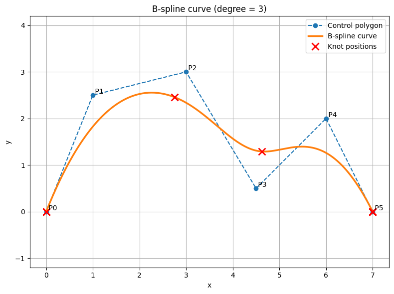
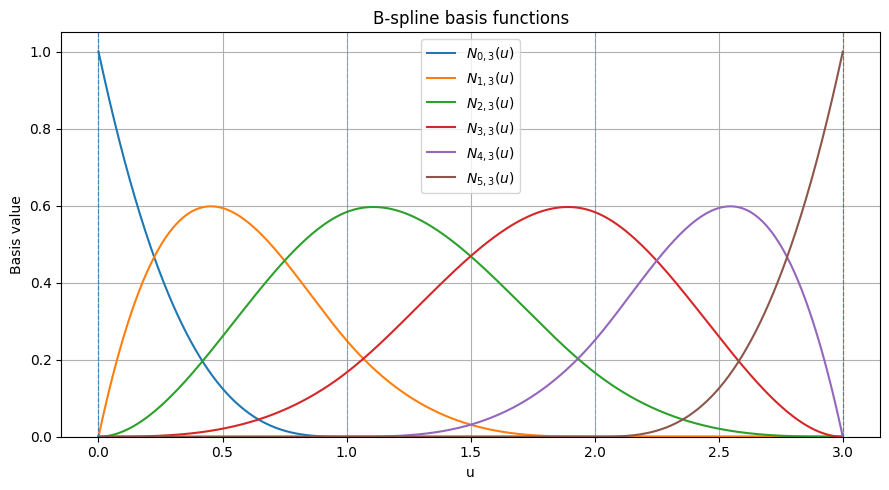

Cubic B-spline curve and corresponding basis functions {math}`N_{i,3}(u)` defined over a clamped uniform knot vector. 
```

The curve (orange) does not interpolate the intermediate control points, but is instead shaped by them, remaining entirely within the convex hull of the control polygon. Due to the cubic degree and the absence of internal knot multiplicities, the curve exhibits {math}`C^2` continuity across knot spans, resulting in a smooth, piecewise-polynomial geometry. The red crosses indicate the positions of the knots mapped onto the curve, illustrating how the parametric domain {math}`u` is transformed into geometric space. Because a clamped knot vector is used, the curve interpolates the first and last control points, and the multiplicity {math}`p+1` at the boundaries enforces this endpoint interpolation.
In the lower plot, the basis functions {math}`N_{i,3}(u)` are shown. Each function has local support over at most {math}`p+1 = 4` knot spans, which explains the locality property of B-splines: each control point influences the curve only over a limited portion of the parameter domain. The smooth overlap of the basis functions ensures a smooth blending of control points. Furthermore, the shape and width of each basis function reflect the spacing of the knots, while increased knot multiplicity would reduce continuity and further localize the influence of the associated control points.

### NOT-Clamped Uniform Knot Vector

Let now see what happens when the curve is defined over a non-clamped uniform knot vector, such as {math}`T=[0, 1, 2, 3, 4, 5, 6, 7, 8, 9]`. The {numref}`bspline_curve_uniform_curve` shows exactly this situation.

```{figure} 
:label: bspline_curve_uniform_curve
(bspline_curve_uniform_curve)=
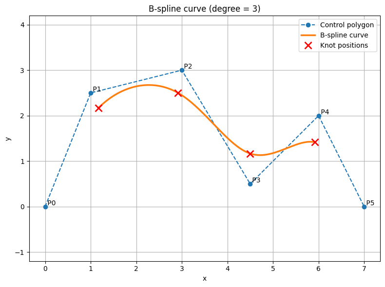
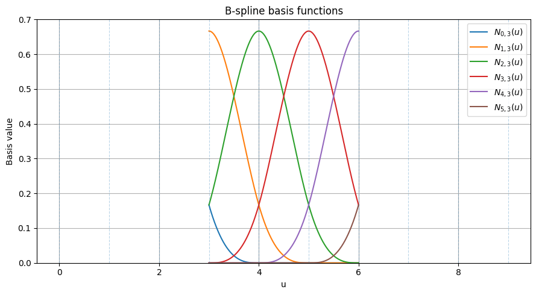

Cubic B-spline curve and corresponding basis functions {math}`N_{i,3}(u)` defined over a non-clamped uniform knot vector. 
```
With this choice, the B-spline curve no longer interpolates the first and last control points, since the boundary knots are not repeated {math}`p+1` times. As a result, the curve is defined only over the parameter interval {math}`[t_p, t_{m-p}] = [3,6]`, and the corresponding knot positions mapped onto the curve are associated only with this internal domain. Geometrically, the curve appears as a central segment influenced by all control points, but without being constrained to pass through the endpoints of the control polygon. The basis functions retain the same cubic degree and therefore the same local support over at most four knot spans, but their shape becomes a translated, more symmetric pattern in the interior of the knot vector. 

This example highlights the role of clamping: while a uniform non-clamped knot vector preserves smoothness and locality, it removes endpoint interpolation and makes the curve behave more like an internal blending of the control polygon rather than a boundary-constrained shape. This behavior is useful in applications where the curve is intended to represent a smooth free-form trend or an intermediate shape, rather than a profile that must pass through prescribed boundary points. For example, non-clamped B-splines are convenient when constructing periodic or closed shapes, when stitching curve segments in a more uniform way, or when emphasizing global fairness and smoothness over exact endpoint control. Moreover, non-clamped B-splines are widely useful beyond CAD. For example, in signal processing and data analysis, they are used for smooth interpolation and approximation of time-series data, where edge effects introduced by clamping would distort the results (See {cite}`Unser_1999` for more detail).

:::{note .simple .dropdown} Closed and Periodic Curves
As said, uniform knot vector is particularly useful when modeling closed or periodic shapes, where the curve is intended to form a smooth loop. In these cases, the absence of clamping allows the spline to maintain uniform continuity across the entire domain, avoiding artificial constraints at the endpoints and enabling seamless transitions in both position and higher-order derivatives.

It is worth spending some words about the distinction between closed and periodic curves. A B-spline curve is said to be closed if its start and end points coincide, i.e., {math}`C(u_{start}) = C(u_{end})`. However, this condition alone does not guarantee smoothness at the junction: the curve may exhibit a discontinuity in its tangent or higher derivatives. A curve is instead periodic if, in addition to matching endpoints, it also has matching derivatives up to a given order at the boundaries (for a spline of degree {math}`p`, typically up to order {math}`p-1`). This ensures that the curve joins seamlessly, with no visible breaks in direction or curvature. Periodic B-splines are therefore particularly suitable for modeling smooth closed shapes, as they provide both geometric closure and continuity, whereas a merely closed curve may still present a sharp transition at the joining point.
:::

### Clamped Non-Uniform Knot Vector
Let us consider a clamped non-uniform knot vector, in which endpoint interpolation is preserved while the internal knot spacing is allowed to vary. With a clamped non-uniform knot vector such as {math}`\mathbf{T} = [0, 0, 0, 0, 0.5, 2.5, 3.0, 3.0, 3.0, 3.0]`, the B-spline curve still interpolates the first and last control points because of the boundary multiplicity {math}`p+1`, but its internal shape is no longer governed by uniformly spaced knot intervals. Instead, the non-uniform distribution of knots modifies the support and relative spread of the basis functions, causing some control points to exert their influence over shorter parameter ranges and others over wider ones. {numref}`bspline_curve_nonuniform_curve` illustrates this situation.
```{figure} 
:label: bspline_curve_nonuniform_curve
(bspline_curve_nonuniform_curve)=
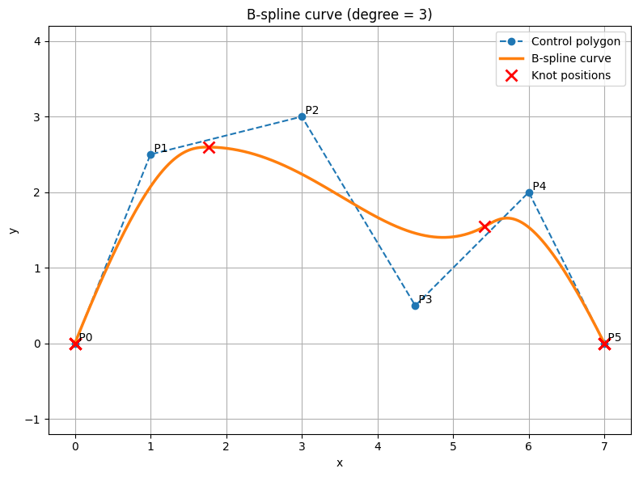
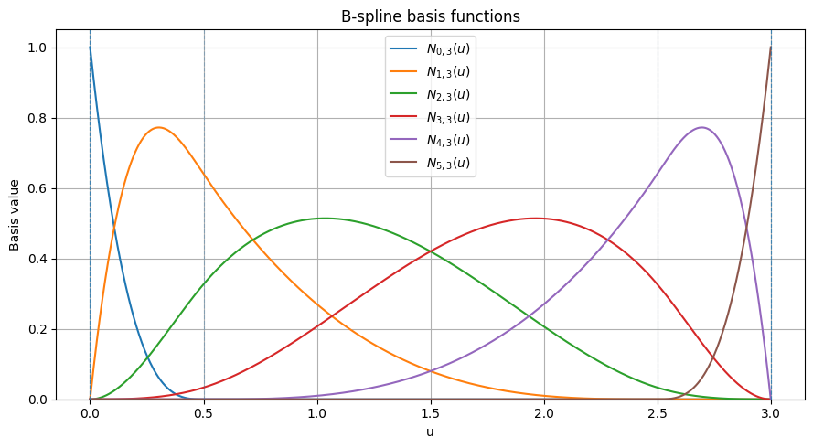

Cubic B-spline curve and corresponding basis functions {math}`N_{i,3}(u)` defined over a clamped non-uniform knot vector. 
```
This is clearly visible in the basis-function plot, where the functions are no longer simple shifted replicas of one another: their peaks, widths, and overlaps are affected by the irregular spacing of the knots. As a consequence, the geometric progression of the curve becomes locally reparameterized, meaning that some portions of the curve are traversed more rapidly in parameter space while others are stretched. This property is particularly useful when greater local control is needed in specific regions of the curve, for example to emphasize shape variations, refine a detail, or adapt the parametrization to non-uniform geometric or data-driven features.


In CAD, clamped non-uniform knot vectors are almost always preferred because they combine two highly desirable properties: interpolation of the endpoints and flexible local shape control. Clamping ensures that the curve passes through the first and last control points, which is important when the modeled shape must satisfy prescribed boundary conditions or connect consistently with other geometric entities. At the same time, allowing the internal knots to be non-uniform provides additional freedom to adapt the parametrization to the geometric distribution of the control points and to concentrate shape control where needed.

Necessary only for internal calculations, knots are usually not helpful to the users of modeling software. Therefore, many modeling applications do not make the knots editable or even visible as this is significantly less intuitive than the editing of control points. In practice, the knot spacing is often not chosen arbitrarily (by the software), but is derived from the distribution of the data points or control points. Two commonly used strategies are chord-length and centripetal parameterizations. 

In the chord-length approach, knot intervals are proportional to the Euclidean distance between consecutive points, resulting in a parametrization that reflects the geometric spacing of the data. Let the data points be {math}`Q_0, Q_1, \dots, Q_m`, and let the associated parameter values be {math}`u_0, u_1, \dots, u_m`, with {math}`u_0 = 0` and {math}`u_m = 1`. In the chord-length approach, the parameter increments are proportional to the Euclidean distances between consecutive points, namely

```{math}
u_0 = 0, \qquad
u_i = u_{i-1} + \frac{\|Q_i - Q_{i-1}\|}{\sum_{j=1}^{m} \|Q_j - Q_{j-1}\|}, \quad i = 1, \dots, m
```

This produces a parametrization that reflects the geometric spacing of the data. The centripetal method (known in rhinoceros as chord-sqrt) refines this idea by using the square root of these distances, which reduces the influence of large gaps and helps prevent unwanted oscillations or clustering effects:

```{math}
u_i = u_{i-1} + \dfrac{\|Q_i - Q_{i-1}\|^{1/2}}{\sum_{j=1}^{m} \|Q_j - Q_{j-1}\|^{1/2}}, \qquad i = 1, \dots, m
```
In general, chord-length parametrization provides a good approximation of the underlying geometry, while the centripetal approach often leads to more stable and visually smoother curves, especially in the presence of irregularly spaced points.

The {numref}`bspline_curve_nonuniform_comparison1` compares three cubic B-spline curves generated from the same set of control points but using different knot configurations: clamped uniform, clamped non-uniform with chord-length parameterization, and clamped non-uniform with centripetal parameterization. 

```{figure} 
:label: bspline_curve_nonuniform_comparison12
(bspline_curve_nonuniform_comparison1)=
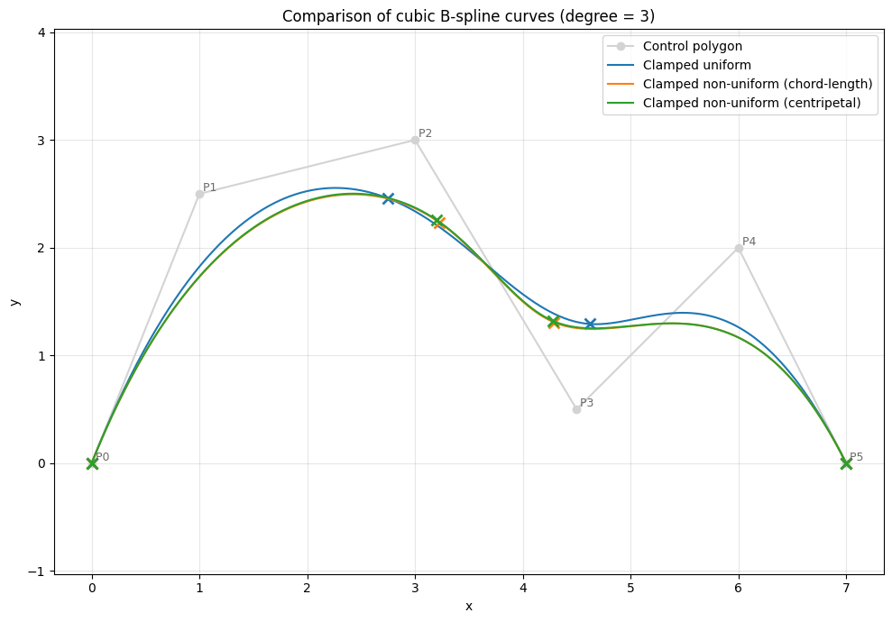

Cubic B-spline curve defined over a clamped uniform, centripetal and chord knot vector. 
```

All three curves interpolate the first and last control points due to the clamped structure of the knot vectors, and they remain within the convex hull of the control polygon. The uniform knot vector distributes the parameter space evenly, resulting in a curve that reflects a purely parametric blending of the control points. In contrast, the non-uniform knot vectors adapt the parametrization to the geometric spacing of the control points: the chord-length approach assigns larger parameter intervals to longer segments, while the centripetal method moderates this effect by using the square root of segment lengths. In this particular example, the control points are relatively well distributed, without extreme variations in spacing. As a result, the knot values obtained from chord-length and centripetal parameterizations are very similar (e.g., {math}`0.4189` vs. {math}`0.4094`, and {math}`0.6157` vs. {math}`0.6076`), leading to curves that are almost indistinguishable. Only minor deviations can be observed in regions where the control polygon changes direction more abruptly. This highlights an important practical observation: when the data points are fairly uniformly spaced, different parametrization strategies tend to produce very similar spline shapes, whereas their differences become more pronounced only in the presence of highly non-uniform point distributions.

The effect of knot distribution becomes particularly evident in interpolation problems. In the {numref}`bspline_curve_nonuniform_comparison_int12`, both curves are interpolating splines and therefore pass exactly through the same prescribed data points, shown as white dots. The only difference between them lies in the choice of the distribution: the black curve is obtained using chord-length parametrization, whereas the red curve is obtained using centripetal parametrization. 
```{figure} 
:label: bspline_curve_nonuniform_comparison_int12
(bspline_curve_nonuniform_comparison_int1)=
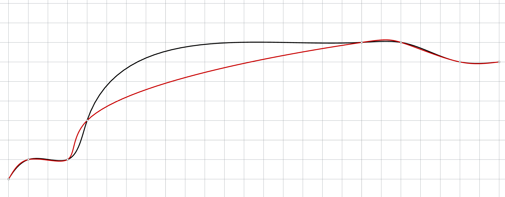

Comparison of interpolating cubic splines obtained with different parametrizations: chord-length (black) and centripetal (red).
```

Although the two splines coincide at the interpolation points, they exhibit noticeably different behavior between them due to the fact that the points are unevenly spaced. The chord-length parametrization assigns parameter intervals directly proportional to the Euclidean distances between consecutive points, so that large gaps produce a faster progression of the parameter. In this example, this leads to a more aggressive rise in the central portion of the curve and to a more pronounced bending in the steep transition region. By contrast, the centripetal parametrization uses the square root of the chord lengths, thereby reducing the influence of large gaps and producing a more balanced parameter distribution. As a result, the red curve evolves more smoothly and gradually, particularly along the long central segment, where it avoids the stronger distortion visible in the chord-length case. This example clearly illustrates that, in interpolation problems, the parametrization has a direct influence on the shape of the curve even when the interpolation points are fixed. 
:::{note}
Parametrization and knot distribution are closely related but distinct concepts: parametrization assigns parameter values to data points, while the knot vector defines the structure of the spline basis functions. In many interpolation schemes, the knot vector is constructed from the parametrization, so that the latter indirectly influences the final curve through the placement of knots.
:::

While approximation splines are generally less sensitive to parametrization, they are not immune to overshoot. However, unlike interpolation, where oscillations are often directly induced by the parametrization, in approximation the control points can partially compensate for irregularities, leading to smoother behavior. As a result, any overshoot is typically less pronounced and depends more on the choice of control points, spline degree, and knot distribution than on the parametrization itself.


###  Internal repeated knot

Let us now consider the effect of internal repeated knots, using the knot vector
{math}`\mathbf{T} = [0, 0, 0, 0, 1, 1, 2, 2, 2, 2]`. As in the clamped case, the multiplicity {math}`p+1` at the boundaries ensures that the curve interpolates the first and last control points. However, in this example, the value {math}`u = 1` is also repeated internally, introducing a knot with multiplicity greater than one inside the parameter domain. This has a direct impact on the smoothness of the curve at that location.
```{figure} 
:label: bspline_curve_internalknots12
(bspline_curve_internalknots12)=
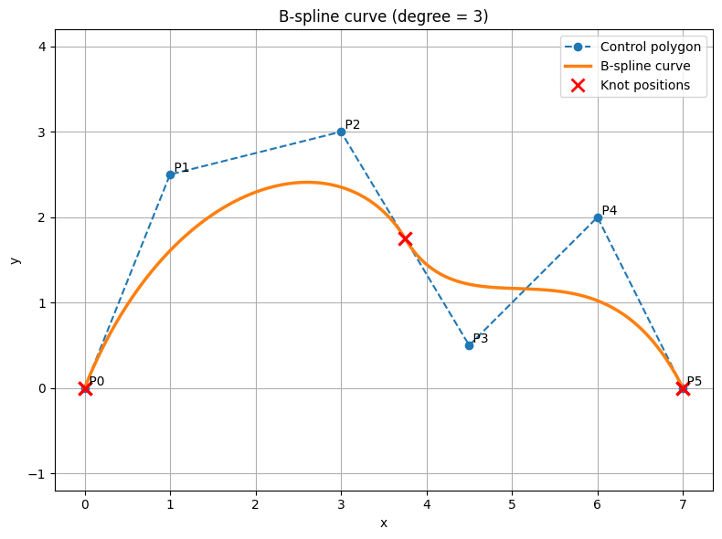
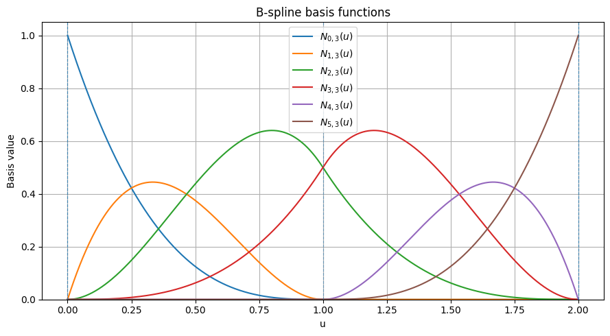

Cubic B-spline curve and corresponding basis functions {math}`N_{i,3}(u)` defined over a clamped knot vector with internally repeated knot. 
```

In general, for a B-spline curve of degree {math}`p`, the continuity at a knot of multiplicity {math}`k` is reduced to {math}`C^{p-k}`. In the present case, with a cubic spline ({math}`p = 3`) and an internal knot of multiplicity {math}`k = 2`, the continuity at {math}`u = 1` is reduced to {math}`C^1`. This means that the curve remains continuous and has a continuous tangent, but its curvature is no longer continuous at that point. Geometrically, this results in a visible change in bending behavior, often perceived as a slight “kink” or loss of smoothness.

From the basis-function perspective, the repetition of a knot reduces the support of the associated basis functions and makes them more localized around the repeated value. As a consequence, the influence of nearby control points becomes more concentrated, increasing local control of the curve. This is a powerful modeling feature: by increasing knot multiplicity, one can locally reduce smoothness and gain tighter control over the shape, without affecting the rest of the curve.

To obtain a reduction of continuity down to {math}`C^0` at an internal location, the multiplicity of the corresponding knot must be carefully chosen. Therefore, in the case of a cubic spline ({math}`p = 3`), achieving {math}`C^0` continuity requires an internal knot of multiplicity {math}`k = 3`. This means that the knot value must be repeated three times within the knot vector. Geometrically, {math}`C^0` continuity ensures that the curve remains continuous, but its tangent direction is no longer continuous at that point, producing a visible corner or sharp transition in the curve. It is important to note, however, that increasing knot multiplicity also affects the size of the knot vector and therefore the required number of control points/degree, since the relation {math}`m = n + p + 1` must still be satisfied.

{numref}`bspline_curve_internalknotsC0_12` illustrates the effect of increasing the multiplicity of an internal knot to achieve {math}`C^0` continuity in a cubic B-spline curve. The knot vector
{math}`\mathbf{T} = [0, 0, 0, 0, 1, 1, 1, 2, 2, 2, 2]` contains the internal value {math}`u = 1` repeated three times, which reduces the continuity at that location from the default {math}`C^2` (for cubic splines) to {math}`C^0`. As a result, the curve remains continuous but exhibits a clear break in its tangent direction at {math}`u = 1`, producing a visible corner. In the case of a cubic b-spline curve, at least 7 control points are needed to get to this situation. 

```{figure} 
:label: bspline_curve_internalknotsC0_12
(bspline_curve_internalknotsC0_12)=
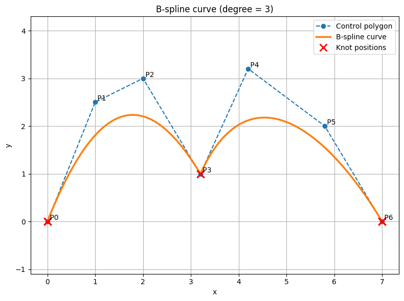
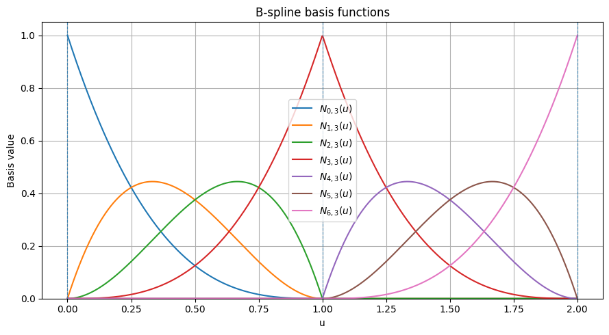

Cubic B-spline curve and corresponding basis functions {math}`N_{i,3}(u)` defined over a clamped knot vector with internally repeated knot to get {math}`C^0`. 
```
Geometrically, this demonstrates how knot multiplicity can be used as a local shape control mechanism: while the rest of the curve retains its smooth, polynomial behavior, the region around the repeated knot becomes less smooth and more tightly influenced by nearby control points. From the basis-function perspective, the repetition of the knot compresses and localizes the support of the corresponding basis functions, effectively reducing their overlap and thus the continuity of the resulting curve. This example highlights a key modeling capability of B-splines, namely the possibility of introducing sharp features or transitions in an otherwise smooth curve without altering its global structure.

The extreme situation is reached when the multiplicity of a knot reaches {math}`k = p+1`, i.e. the continuity becomes {math}`C^{p-k} = C^{-1}`, which means that the curve is no longer continuous at that parameter value. In practice, this corresponds to a break in the curve, where two independent spline segments meet without sharing a common point. Geometrically, the curve is “cut” at that knot, and each side behaves as a separate B-spline defined over its own interval. This situation can be interpreted as a complete loss of interaction between the basis functions on either side of the knot: their supports no longer overlap, so there is no blending across the knot value. While such a configuration is generally not used when a continuous curve is desired, it can be useful in modeling when one wants to explicitly define piecewise-independent segments within a single spline representation, for example to manage discontinuities, segment boundaries, or multi-patch constructions.


## Non Uniform Rational B-Spline
Non-Uniform Rational B-Splines (NURBS) extend B-splines by introducing weights, enabling the exact representation of conic sections (e.g., circles, ellipses) and providing greater flexibility in shape control (as detaild in the chapter about rational curve).

A NURBS curve of degree {math}`p` is defined as:
```{math} 
\mathbf{C}(u) = \frac{\displaystyle \sum_{i=0}^{n} w_i \mathbf{P}_i \, N_{i,p}(u)}{\displaystyle \sum_{i=0}^{n} w_i \, N_{i,p}(u)}, \qquad u \in [u_p, u_{m-p}]
```

where {math}`\mathbf{P}_i` are the control points, {math}`w_i > 0` are the associated weights, {math}`N_{i,p}(u)` are the B-spline basis functions of degree {math}`p`, {math}`\mathbf{T} = [u_0, u_1, \dots, u_m]` is the knot vector and {math}`m = n + p + 1`. 

The presence of weights makes the curve rational, meaning it is expressed as a ratio of two polynomial functions. This can be rewritten using rational basis functions:
```{math} 
R_{i,p}(u) = \frac{w_i N_{i,p}(u)}{\sum_{j=0}^{n} w_j N_{j,p}(u)}
```
so that the curve becomes:
```{math} 
\mathbf{C}(u) = \sum_{i=0}^{n} \mathbf{P}_i \, R_{i,p}(u)
```
The weights {math}`w_i` control the influence of each control point: increasing {math}`w_i` pulls the curve closer to {math}`\mathbf{P}_i` while decreasing {math}`w_i` reduces its influence. If all weights are equal, the NURBS curve reduces to a standard B-spline.

NURBS curves inherit the main properties of (non-uniform) B-splines. In addition, NURBS provide exact representation of conics (circles, arcs, ellipses) and greater geometric flexibility through weights. For this reason, they are the standard representation in CAD systems.

## Conclusion

B-splines provide the standard polynomial curve model for engineering CAD. They are the direct bridge from the Bezier and spline foundations covered so far to NURBS, surface patches, fitting workflows, and analysis-oriented geometry pipelines.
