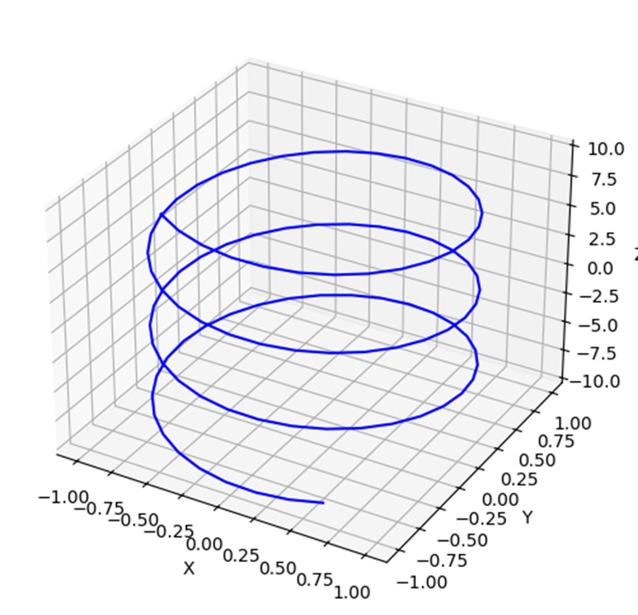
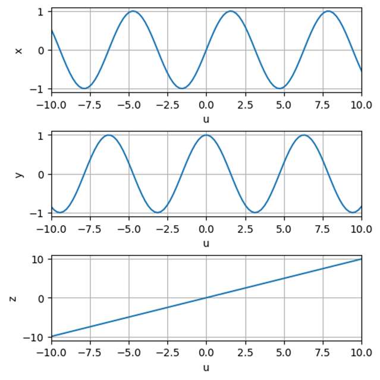

# Motivations

In Computer-Aided Design (CAD), intended here not as mere *“3D modeling”* but as the broader activity of designing supported by computers, we must deal with complex geometries and represent them in a way that is both mathematically rigorous and computationally efficient.

:::{blockquote}
The decision to use computers in the design process forces the designer to describe all shapes in mathematical terms.

— *Gerald Farin*, Arizona State University
:::

The use of computers in design therefore requires a formal mathematical framework capable of describing and modifying geometric entities in three-dimensional space.
In particular, we have:

- a mathematical framework for one-dimensional geometric entities  (curves)
- a mathematical framework for two-dimensional manifolds embedded in 3D space (surfaces)
- representation schemes for volumetric objects (solids)

Please notice that the distinction between curves/surfaces (a framework) and solids (schemes) is not accidental {ref}`(See the note)<representation-schemes>`.

(representation-schemes)=
:::{note  .dropdown icon=false open=false}
In CAD, curves and surfaces are primarily treated as continuous geometric objects defined through mathematical models, grounded in differential geometry and approximation theory.
Specifically, a curve is a parametric functions:
```{math}
\mathbf{c}(u) : \mathbb{R} \rightarrow \mathbb{R}^3
```
a surface is a parametric mappings:
```{math}
\mathbf{s}(u,v) : \mathbb{R}^2 \rightarrow \mathbb{R}^3
```
A solid, instead, is not simply a higher-dimensional parametric mapping.A volumetric object in CAD must encode: interior versus exterior, topology (faces, edges, vertices), boundary consistency, etc... Therefore, there is no single canonical “parametric solid function” equivalent to those used for curves or surfaces.
Solids are defined through representation schemes, such as: Boundary Representation (B-Rep), Constructive Solid Geometry (CSG), voxel models, implicit representations,
half-edge and other topological data structures. These are not merely mathematical descriptions, they are data structures together with rules that encode both geometry and topology.

So, curves and surfaces are primarily analytic and differential entities while solids are primarily geometric–topological entities requiring structured data organization.
:::

As emphasized above, this perspective is not limited to geometric modeling alone. The mathematical representation of curves, surfaces, and solids plays a fundamental role in many other fields. For instance, in robotics, smooth geometric representations are essential for motion planning, trajectory generation, and kinematic control (see, e.g., {cite}`Maekawa_1999`). Accurate and computationally efficient geometric models directly influence the performance, safety, and feasibility of robotic systems. Similarly, in numerical simulation and engineering analysis, geometric representations directly affect mesh generation, isogeometric analysis ({cite}`Maekawa_1999`), and the accuracy of finite element methods. In these contexts, the quality and smoothness of the geometric model are not merely aesthetic concerns, but directly impact computational performance and solution accuracy.


## Curves

A curve is the locus of a one-parameter family of points. In computational geometry, a curve can be defined more precisely as a mapping:

```{math}
\mathbf{C}: \mathbb{R} \rightarrow \mathbb{R}^3
```

meaning that for every parameter value {math}`u`, the curve returns a point in 3D space.

Different mathematical representations exist (intrinsic, explicit, implicit, parametric), but for CAD and computational applications we need a framework that is:

- **independent of the chosen coordinate system**, so that shape does not change when the reference frame changes;
- **computable**, i.e. easy to evaluate, differentiate, and integrate numerically;
- **flexible**, to represent planar and non-planar geometries;
- **controllable**, so that designers can modify the shape locally and predictably.

Explicit and implicit equations are useful in mathematics, but they are not the best foundation for geometric modeling systems.

## Explicit Equations

In the plane, the explicit equation of a curve takes the general form:

```{math}
y = f(x)
```

This form has important limitations:

- there is only one {math}`y` value for each {math}`x`;
- it cannot represent closed curves or multi-valued geometries.

## Implicit Equations

An implicit curve in the plane is defined as:

```{math}
f(x,y)=0
```

Example: a unit circle in the {math}`XY` plane:

```{math}
f(x,y)=x^2+y^2-1=0
```

```{figure}./imgs/image.png
:label: myFigure
:alt: Circle in a plane
:align: center

circle lying in the XY plane
```

Implicit equations avoid some limitations of explicit ones, but they still present major issues for CAD:

- they are **axis-dependent**;
- they are harder to sample parametrically. As they do not provide a natural parameterization, generating points on the curve (needed for tessellation, meshing, and rendering) typically requires numerical procedures such as root finding or marching algorithms.
- geometric properties (tangents, curvature) are not naturally expressed;
- extending to bounded, trimmed, or non-planar curves is non-trivial.

## Why explicit and implicit forms are not ideal for modeling

Both explicit and implicit representations are **axis-dependent**.

- The shapes of most objects are intrinsically independent of any coordinate system. We need a modeling framework where the choice of a CSYS does not affect the shape.
- Any solid (closed object) will have tangent lines or tangent planes that may become parallel to principal axes of the chosen CSYS. This can lead to ill-defined mathematical properties or numerical instabilities.
- Curves and surfaces are often non-planar and bounded, making them difficult to represent robustly using explicit and implicit equations.

For programming and computability, other forms are preferable.

## Parametric Equations of Curves

A parametric curve in the plane is written as:

```{math}
\begin{cases}
x = x(u) \\
y = y(u)
\end{cases}
```

In 3D:

```{math}
\begin{cases}
x = x(u) \\
y = y(u) \\
z = z(u)
\end{cases}
```

Example: a helix

```{math}
\begin{cases}
x=\sin(u) \\
y=\cos(u) \\
z=u
\end{cases}
```

:::{figure}
:label: Helix
:alt: Helix
:align: center
:class: grid grid-cols-2 items-end gap-4 

(Helix3D)=


(HelixPar)=


Helix in the 3D and Parametric Space
:::

Parametric representations are the standard approach in CAD and computational geometry because:

- they are **coordinate-system independent**;
- they can represent **bounded, non-planar curves** naturally;
- they enable **efficient evaluation and differentiation** (tangent, curvature, arc length, etc.);
- they provide a consistent foundation for curves, surfaces, and solid modeling schemes.

## The key question: how do we build parametric curves in a general way?

A parametric curve is only as useful as the functions used to define {math}`x(u), y(u), z(u)`.

In the helix example, we selected:

```{math}
\{\sin(u), \cos(u), u\}
```

but these functions are too specific: they generate one particular curve and do not provide a general modeling framework.

In engineering design we often need to solve a more general problem:

> Given a set of points, find a smooth curve interpolating or approximating the data.

To address this, we need a **generic and controllable way** to construct parametric curves.

## From “functions” to a modeling framework: basis functions

Instead of defining {math}`x(u), y(u), z(u)` independently, we build the curve as a linear combination of **basis functions**:

```{math}
\mathbf{C}(u)=\sum_{i=0}^{n} \mathbf{P}_i\,N_i(u)
```

where:

- {math}`\mathbf{P}_i \in \mathbb{R}^3` are **control points**{ref}`(see note)<control-point-note>`; 
- {math}`N_i(u)` are **basis functions**{ref}`(see note)<basis-function-note>` that determine the shape, continuity, and smoothness;
- the curve becomes controllable by editing {math}`\mathbf{P}_i`.

(control-point-note)=
:::{note .simple .dropdown icon=false open=false} Control Point
**Control points** are not points on the curve. Points on the curve are outcomes (results) of the representation and are not suitable parameters for design: specifying them leads either to piecewise-linear approximations or to unstable global interpolation problems. Control points, instead, act as a compact set of design variables that shape the curve through basis functions, enabling smoothness, efficient evaluation, and predictable local editing.

If we need the curve to pass through data points, we do that via:

- **interpolation**: solve for control points such that {math}`C(u_k)=Q_k`
- **approximation / fitting**: least squares
- **constraint-based modeling**: force certain curve points to match

So even when we start from points on the curve, we still convert them into control points.
:::

(basis-function-note)=
:::{note .simple .dropdown icon=false open=false} Basis Function
A set of basis functions $\{Ni(u)\}$ is a collection of functions that span a space of parametric curves. Any curve in this space can be written as a linear combination  $\sum_{i} P_i N_i(u)$, where the coefficients $P_i$ are the control points.
 :::


This is the fundamental idea behind curves and surface representation in CAD. The choice of basis functions is what turns parametric equations into a powerful and general modeling system. Basis functions span a function space: they define what shapes are possible and what properties the curve will have. Different choices of basis functions produce different curve families:

- power basis $\rightarrow$ polynomials in $u$
- Bernstein basis $\rightarrow$ Bézier curves
- B-spline basis $\rightarrow$ B-splines
- rational B-spline basis $\rightarrow$ NURBS

The choice of basis functions determines key geometric and computational features, such as degree of the curve, continuity, local vs global control (local support or not), smoothness and fairness and the ability to represent special shapes (e.g., conics). So basis functions are not just “mathematical convenience”: they are the core design decision behind a modeling system.