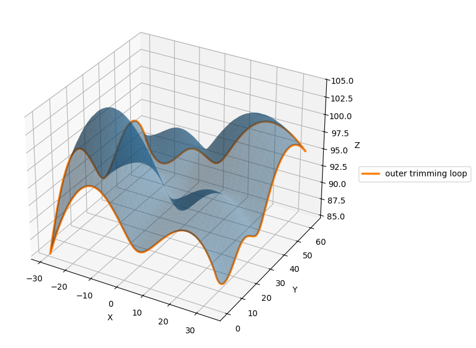
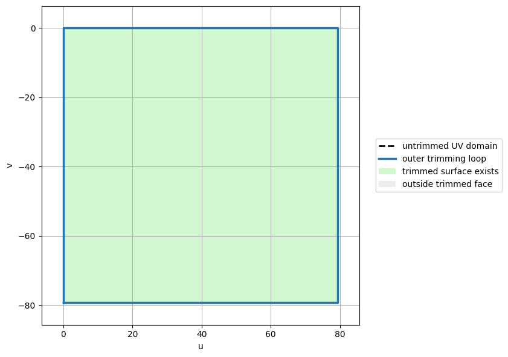
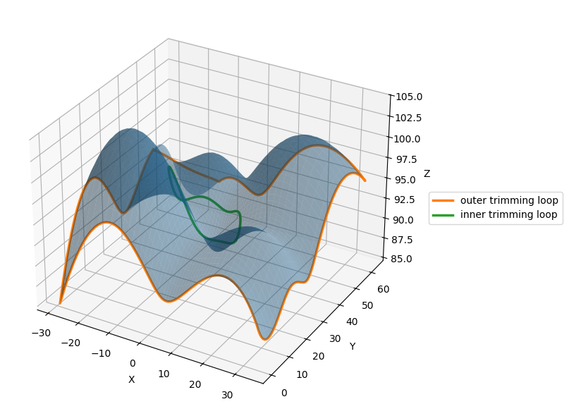
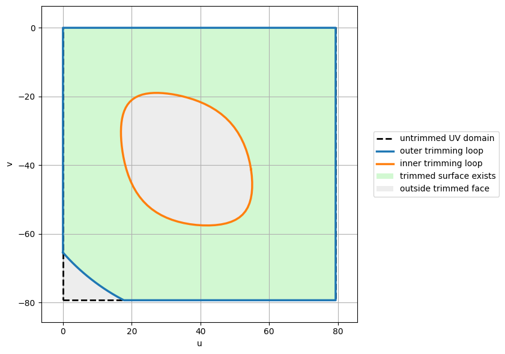

(ch-surfaces)=
# Parametric Surfaces

So far, geometric entities have been described using a single parameter
{math}`u`. This leads to curves embedded in space, written in the general form

```{math}
\mathbf{C}(u) = \bigl(x(u),y(u),z(u)\bigr)
```

A surface is the natural extension of this idea to two independent parameters.
Instead of moving along a one-dimensional parameter interval, we move over a
two-dimensional parameter domain.

A parametric surface is defined as a mapping

```{math}
\mathbf{S}(u,v)
= \bigl(x(u,v),y(u,v),z(u,v)\bigr),
\qquad (u,v)\in\Omega,
```

where {math}`\Omega \subset \mathbb{R}^2` is the parameter domain.

Geometrically, the surface is obtained by associating each parameter pair
{math}`(u,v)` with one point in space. A parametric surface can be understood from three complementary points of view. 

As a **mapping** 
```{math}
\mathbf{S}(u,v)
= \bigl(x(u,v),y(u,v),z(u,v)\bigr),
\qquad (u,v)\in\Omega,
```
where {math}`\Omega \subset \mathbb{R}^2` is the parameter domain. The image of this mapping lies in physical space, usually {math}`\mathbb{R}^3` in CAD applications. Geometrically, the surface is obtained by associating each parameter pair {math}`(u,v)` with one point in space. In this sense, the parameter domain plays the same role as the interval of a curve, but with one additional direction.
  
As a **family of curves**, where, one parameter is fixed and the other is allowed to vary:
  ```{math}
  \mathbf{S}(u,v_0)
  \qquad \text{or} \qquad
  \mathbf{S}(u_0,v)
  ```
The first expression describes a curve obtained by fixing {math}`v=v_0` and varying {math}`u`. The second expression describes a curve obtained by fixing {math}`u=u_0` and varying {math}`v`. These two families are called isoparametric curves. Together, they form a grid on the surface, often called the parametric net. In CAD systems, this
net is important because it reveals how the two parameter directions are organized and how the surface will be evaluated, trimmed, subdivided, or connected to other patches.
  
Finally, as a {term}`tensor product` construction. 
```{math}
\mathbf{S}(u,v)
=
\sum_{i=0}^{n}\sum_{j=0}^{m}
\mathbf{P}_{i,j} N_{i,p}(u) M_{j,q}(v)
```
where The coefficients {math}`\mathbf{P}_{i,j}` define the control net. Most parametric surfaces used in CAD are constructed as tensor products of curve
bases. The idea is to choose one basis in the {math}`u` direction and another basis in the {math}`v` direction. Let {math}`N_{i,p}(u)` be basis functions of degree {math}`p` in the {math}`u` direction, and let {math}`M_{j,q}(v)` be basis functions of degree {math}`q` in the {math}`v` direction. A tensor-product surface is written as
```{math}
\mathbf{S}(u,v)
=
\sum_{i=0}^{n}\sum_{j=0}^{m}
\mathbf{P}_{i,j}\,N_{i,p}(u)\,M_{j,q}(v).
```
The coefficients {math}`\mathbf{P}_{i,j}` are control points arranged in a control net. This is the surface analogue of the control polygon used for curves.
The tensor-product construction is therefore a direct extension of the basis-function representation introduced for curves:
```{math}
\mathbf{C}(u)=\sum_{i=0}^{n}\mathbf{P}_i N_i(u).
```
For curves, each control point is associated with one basis function. For surfaces, each control point is associated with the product of one basis function in the {math}`u` direction and one basis function in the {math}`v` direction.

:::{note} Control net
The indices {math}`i,j` are not only labels. They define the connectivity of the control net. Neighboring control points in the grid determine neighboring regions of the surface, and the two grid directions correspond to the two parameter directions {math}`u` and {math}`v`.
:::

In general, a tensor-product spline surface does not interpolate all control points. Instead, it is shaped by the control net. As in the curve case, the control points act as design variables, while the basis functions determine the smoothness, locality, and approximation properties of the representation.

:::{prf:example} Bilinear surface
The simplest tensor-product surface is obtained by using linear basis functions
in both parameter directions. Let {math}`(u,v)\in[0,1]\times[0,1]`. Given four
corner points {math}`\mathbf{P}_{00}`, {math}`\mathbf{P}_{10}`,
{math}`\mathbf{P}_{01}`, and {math}`\mathbf{P}_{11}`, the bilinear patch is

```{math}
\mathbf{S}(u,v)
=
(1-u)(1-v)\mathbf{P}_{00}
+u(1-v)\mathbf{P}_{10}
+(1-u)v\mathbf{P}_{01}
+uv\mathbf{P}_{11}.
```

This surface interpolates the four corner points. Along each boundary, one parameter is fixed and the patch reduces to a linear curve. Inside the domain, the surface is obtained by blending the four corners through two independent linear interpolations.

The bilinear patch is the surface counterpart of linear interpolation for curves. More advanced CAD surfaces follow the same tensor-product principle, but replace the linear basis functions with Bernstein, B-spline, or rational B-spline basis functions.
:::

These are not different definitions, but different ways to understand the same object. The tensor-product view explains the formula, the control
net explains how the shape is edited, and the family-of-curves view explains the geometry of the parameter directions.


# Properties

Parametric surfaces inherit properties from the curve representations studied earlier: local control, when locally supported spline bases are used; continuity control, through the degree and the knot vectors in each parameter direction; affine invariance; convex-hull behavior, in the same sense as the underlying curve basis.
On top of them, surfaces introduce additional complexity:

- there are two parameter directions instead of one;
- the degrees and knot vectors may differ in the {math}`u` and {math}`v`
  directions;
- geometric behavior may be anisotropic, meaning that the surface can behave
  differently along the two parameter directions;
- continuity must be considered not only along curves, but also across patch
  boundaries.

This last point is especially important in CAD. Complex models are rarely
described by a single surface patch. They are usually assembled from many
patches, and the quality of the resulting model depends strongly on how these
patches meet.

**Surface evaluation** mean evaluating a surface at a parameter that is within the surface domain results in a
point that is on the surface. Keep in mind that the middle of the domain (midu,
midv) might not necessarily evaluate to the middle point of the 3-D surface. Also,
evaluating u- and v-values that are outside the surface domain will not give a useful
result.

# NURBS Surfaces

NURBS surfaces extend the concept of NURBS curves to two parameters, combining the tensor-product construction of surfaces with the rational formulation introduced for curves. As for curves, the key idea is to combine B-spline basis functions (to control smoothness and locality) and weights (to control geometric influence and enable exact shapes). A NURBS surface of degree {math}`p` in the {math}`u` direction and degree {math}`q` in the {math}`v` direction is defined as:
```{math}
\mathbf{S}(u,v) =
\frac{
\displaystyle \sum_{i=0}^{n} \sum_{j=0}^{m}
w_{i,j} \, \mathbf{P}_{i,j} \, N_{i,p}(u)\, M_{j,q}(v)
}{
\displaystyle \sum_{i=0}^{n} \sum_{j=0}^{m}
w_{i,j} \, N_{i,p}(u)\, M_{j,q}(v)
}
```
where:
- {math}`\mathbf{P}_{i,j}` are control points arranged in a control net,
- {math}`w_{i,j} > 0` are the associated weights,
- {math}`N_{i,p}(u)` and {math}`M_{j,q}(v)` are B-spline basis functions,
- {math}`\mathbf{T}_u` and {math}`\mathbf{T}_v` are knot vectors,
- {math}`(u,v)` belongs to the parametric domain.


## Trimmed NURBS surfaces
A NURBS surface is naturally defined over a rectangular parameter domain. {numref}`UnTrimmed` shows a generic, single-patch, untrimmed surface.

```{figure} ../imgs/UnTrimmed_Hole.png
:label: UnTrimmed
:alt: UnTrimmed Surface
:align: center

Untrimmed NURBS surface. The red curves represent the isoparametric curves on the surface, while the grey dashed polyline indicates the control net used to shape the geometry.
```

In the untrimmed case, the whole domain is mapped to physical space through the surface function:
```{math}
\mathbf{S}(u,v)
=
\bigl(x(u,v),y(u,v),z(u,v)\bigr),
\qquad (u,v)\in\Omega .
```
For a tensor-product NURBS surface, the domain {math}`\Omega` is usually a rectangle in the {math}`uv` parameter space. Every point inside this rectangle corresponds to a point on the surface in three-dimensional space. This is the case shown in {numref}`UnTrimmed_domain`, where the entire underlying surface is visible. This relationship is illustrated by comparing the UV domain with the corresponding
three-dimensional surface. In the parameter space, the valid domain occupies the
whole rectangular region. Since no inner trimming loop removes any portion of the
domain, all parameter pairs inside the rectangle are evaluated by the surface
mapping. As a result, the 3-D representation shows the complete underlying NURBS
patch, bounded only by its natural outer boundary.

```{figure} 
:label: UnTrimmed_domain
(UnTrimmed_domain)=




Untrimmed NURBS surface and corresponding UV parameter domain. The full rectangular parameter domain is valid and maps to the complete visible surface. The outer loop coincides with the boundary of the untrimmed domain, so no internal regions are removed and the surface has no holes or cutouts.
```

In many CAD models, however, the desired face is not the whole rectangular surface patch. Instead, only a portion of the underlying NURBS surface is used. This is the purpose of trimming. A trimmed NURBS surface is obtained by combining an underlying untrimmed NURBS surface with one or more trimming curves defined in the parameter domain.

The trimming curves do not redefine the mathematical surface itself. The underlying NURBS surface remains unchanged. What changes is the region of the parameter domain that is considered valid. Only the parameter pairs
{math}`(u,v)` that lie inside the trimming boundary are mapped to visible points of the CAD face.
Take for example the surface shown in {numref}`Trimmed`. The patch is obtained from the previously shown untrimmed surface ({numref}`UnTrimmed`) by removing an internal region, which produces a hole, and by cutting away part of the outer boundary.

```{figure} ../imgs/Trimmed_Hole.png
:label: Trimmed
:alt: Trimmed Surface
:align: center

Trimmed NURBS surface. The red curves represent the isoparametric curves on the surface, while the grey dashed polyline indicates the control net used to shape the geometry.
```

In other words, a trimmed surface can be described as:

```{math}
\mathbf{S}_T(u,v)
=
\mathbf{S}(u,v),
\qquad (u,v)\in\Omega_T \subset \Omega ,
```

where {math}`\Omega` is the original rectangular parameter domain of the untrimmed surface, and {math}`\Omega_T` is the trimmed domain. The trimmed domain is bounded by one or more closed trimming loops.

The outer trimming loop defines the external boundary of the face. Inner trimming loops define holes or excluded regions. A point of the parameter domain belongs to the trimmed surface if it lies inside the outer loop and outside all inner loops. This means that the same underlying NURBS surface can produce very different visible faces depending on the trimming curves applied to it.
{numref}`Trimmed` shows an example of a trimmed surface while the corresponding parameter-space representation is shown in {numref}`Trimmed_domain`. The rectangular dashed boundary represents the untrimmed NURBS domain, while the trimming loops define the actual region of the surface that remains visible.

```{figure} 
:label: Trimmed_domain
(Trimmed_domain)=




Trimmed NURBS surface and its UV parameter domain. The dashed rectangle indicates the original untrimmed parameter domain, while the blue outer trimming loop and orange inner trimming loop define the actual valid region of the face. Only the green region in parameter space is mapped to the visible 3D surface; the grey region is excluded, producing the hole and the trimmed corner.
```

This distinction between the underlying surface and the trimmed face is fundamental in CAD. The NURBS surface provides the smooth mathematical geometry, while the trimming curves define which part of that geometry belongs
to the model. Therefore, a CAD <ins>face</ins> is not only a surface equation: it is a surface together with boundary information.

Trimming is especially important because many engineering shapes cannot be represented conveniently as a single rectangular surface patch. Holes, cutouts, fillets, intersections, and complex boundaries are usually represented by trimming otherwise regular NURBS surfaces. This allows CAD systems to preserve the advantages of tensor-product NURBS surfaces while still representing complex topologies.

However, trimmed surfaces also introduce additional complexity. The boundary of the face is no longer determined only by the natural limits of the surface parameters. It is determined by trimming curves, which must be evaluated and mapped from parameter space to three-dimensional space. A trimming curve in the {math}`uv` domain corresponds to a three-dimensional edge on the surface:

```{math}
\mathbf{C}_{3D}(t)
=
\mathbf{S}\bigl(u(t),v(t)\bigr).
```

Thus, the 3-D boundary of the face is obtained by evaluating the surface along the 2-D trimming curves. This is why trimmed surfaces are commonly represented inside a boundary representation, or BRep, structure. The BRep stores the underlying surface, the trimming curves, the corresponding 3-D edges, and the topological relationships between faces, edges, and vertices.

From a modeling point of view, this also explains why editing trimmed surfaces can be more difficult than editing untrimmed ones. Moving the control points of the underlying NURBS surface changes the geometry, but the trimming curves and neighboring faces must still remain consistent. If two adjacent faces share a trimmed edge, modifying one surface may create gaps or overlaps unless the shared boundary is updated within the required tolerance.

# Solid by Boundary Representations
A boundary representation, or BRep, describes a solid or surface model through the entities that form its boundary. Instead of representing the object as a single global equation, a BRep model stores a collection of connected topological elements: faces, wires, edges, and vertices.

The main idea is to separate **geometry** from **topology**. Geometry describes the shape of each element, for example a NURBS surface, a curve, or a point. Topology describes how these elements are connected to one another.

At the highest level, a BRep solid is bounded by a set of faces. Each face is associated with an underlying surface, usually a parametric surface such as a NURBS surface. However, the face does not necessarily correspond to the whole surface. In the case of a trimmed NURBS surface, the face corresponds only to the portion of the underlying surface that lies inside its trimming boundaries.

A face is bounded by one or more wires. A wire is a closed sequence of connected edges. The outer wire defines the external boundary of the face, while inner wires define holes or internal cut-outs. This is why trimmed NURBS surfaces are naturally represented in a BRep structure: the underlying NURBS surface provides the smooth geometry, while the wires define the valid portion of the surface.

Each wire is composed of edges. An edge represents a boundary curve between two vertices. In a BRep model, an edge usually has two geometric descriptions. First, it has a three-dimensional curve that represents the edge in physical space. Second, when the edge lies on a parametric surface, it also has a two-dimensional
curve in the surface parameter domain.

The vertices are the zero-dimensional topological entities of the BRep. They mark the start and end points of edges. Geometrically, a vertex stores a point in 3-D space. Topologically, it defines how edges meet.

For a complete solid, several faces are connected through shared edges. Two neighboring faces may have different underlying surfaces, different parameterizations, and different trimming curves, but they can still share the
same topological edge. This shared edge defines the adjacency between the faces.

This separation between surface geometry and topological connectivity is one of the main strengths of BRep modeling. It allows CAD systems to represent complex objects made of many trimmed surfaces joined together. At the same time, it also introduces modeling challenges. When a surface is modified, the adjacent edges, vertices, and neighboring faces must remain consistent within the required geometric tolerance. Otherwise, gaps, overlaps, or invalid connections may appear in the model.